# BÁO CÁO BÀI TẬP LỚN

## PHÂN TÍCH THIẾT KẾ HƯỚNG ĐỐI TƯỢNG

### Đề tài: Hệ thống website cho thuê nhà ODauDay Stay

| Thông tin | Nội dung |
|---|---|
| Trường | Đại học Giao thông Vận tải |
| Học phần | Phân tích thiết kế hướng đối tượng (OOAD) |
| Lớp | **[Điền lớp]** |
| Nhóm | **[Điền số/tên nhóm]** |
| Sinh viên thực hiện | **[Điền họ tên và mã sinh viên]** |
| Giảng viên | **[Điền tên giảng viên]** |
| Thời gian | **[Điền tháng/năm nộp]** |

> **Quy ước tài liệu:** các sơ đồ được viết bằng Mermaid để bảo đảm có thể chỉnh sửa, không phải hình vẽ tay.
>
> Toàn bộ 22 sơ đồ đã được render sẵn thành ảnh tại `docs/diagrams/svg/` (vector, ưu tiên dùng) và `docs/diagrams/png/` (raster 3x). Danh mục và hướng dẫn tái tạo xem tại `docs/diagrams/README.md`.
>
> Khi sửa sơ đồ, hãy sửa mã Mermaid trong tài liệu này rồi chạy lại:
>
> ```bash
> python3 _extract_mermaid.py "docs/nguon-tai-lieu/Bao_Cao_BTL_OOAD_NAL_Stay_Hoan_Chinh.md" docs/diagrams/src
> ./render-diagrams.sh
> ```
>
> Mermaid không có ký pháp Use Case/Activity gốc của UML (tác nhân là hình chữ nhật thay vì hình người que). Nếu giảng viên yêu cầu ký pháp UML chuẩn, hãy vẽ lại các sơ đồ Use Case, Activity và Object bằng StarUML/Visual Paradigm/draw.io và giữ bản Mermaid làm tài liệu nguồn.

---

## Mục lục

1. [Chương 1 — Phân tích yêu cầu](#chương-1--phân-tích-yêu-cầu)
2. [Chương 2 — Phân tích đối tượng](#chương-2--phân-tích-đối-tượng)
3. [Chương 3 — Thiết kế hệ thống](#chương-3--thiết-kế-hệ-thống)
4. [Thiết kế cơ sở dữ liệu](#34-thiết-kế-cơ-sở-dữ-liệu)
5. [Chương 4 — Cài đặt và kiểm thử](#chương-4--cài-đặt-và-kiểm-thử-khuyến-khích)
6. [Ma trận truy vết](#ma-trận-truy-vết-yêu-cầu--thiết-kế--dữ-liệu--kiểm-thử)
7. [Kết luận](#kết-luận)
8. [Phụ lục A — Hồ sơ yêu cầu](#phụ-lục-a--hồ-sơ-xác-định-và-thẩm-định-yêu-cầu)
9. [Phụ lục B — Activity Diagram](#phụ-lục-b--activity-diagram)
10. [Phụ lục C — Object Diagram và OOP](#phụ-lục-c--object-diagram-và-minh-chứng-oop)
11. [Phụ lục D — 4+1 và kiến trúc triển khai](#phụ-lục-d--lựa-chọn-view-và-kiến-trúc-triển-khai)
12. [Phụ lục E — Quản lý nhóm và vấn đáp](#phụ-lục-e--quản-lý-nhóm-78-người-và-chuẩn-bị-vấn-đáp)
13. [Phụ lục F — Quality Gate](#phụ-lục-f--quality-gate-trước-khi-nộp)
14. [Tài liệu tham khảo](#tài-liệu-tham-khảo)

---

# Chương 1 — Phân tích yêu cầu

## 1.1. Giới thiệu bài toán

ODauDay Stay là hệ thống web kết nối **khách thuê** với **chủ nhà**. Khách có thể tìm kiếm chỗ ở, xem thông tin nhà/phòng, gửi yêu cầu đặt phòng, theo dõi hoặc huỷ đơn và đánh giá sau khi hoàn thành kỳ lưu trú. Chủ nhà có thể đăng nhà/phòng, quản lý lịch khả dụng, xác nhận hoặc từ chối đơn và xem doanh thu. Quản trị viên quản lý tài khoản và quyền truy cập.

Mục tiêu của hệ thống là số hoá quy trình tìm và đặt chỗ, giảm trao đổi thủ công, hạn chế đặt trùng phòng, lưu lại lịch sử giao dịch và cung cấp thông tin minh bạch cho cả khách và chủ nhà.

## 1.2. Khảo sát nghiệp vụ và vấn đề hiện tại

Khảo sát dựa trên kịch bản giả định phía khách thuê kết hợp nghiên cứu tài liệu các nền tảng cho thuê công khai (chi tiết ở Phụ lục A).

| Đối tượng | Quy trình hiện tại | Vấn đề (pain point) | Nhu cầu |
|---|---|---|---|
| Khách thuê | Tìm bài đăng, liên hệ chủ nhà qua điện thoại/tin nhắn | Thông tin phân tán; không biết phòng còn trống; khó kiểm chứng đánh giá | Tìm kiếm tập trung, biết giá và lịch trống, đặt phòng có trạng thái rõ ràng |
| Chủ nhà | Ghi lịch đặt bằng sổ hoặc bảng tính | Dễ trùng lịch; khó tổng hợp doanh thu; trả lời lặp lại | Quản lý nhà/phòng, chặn lịch, xử lý đơn và xem báo cáo |
| Quản trị viên | Xử lý vi phạm thủ công | Khó kiểm soát tài khoản và nội dung | Khoá/mở tài khoản, phân quyền và theo dõi dữ liệu |

## 1.3. Mục tiêu và phạm vi

### 1.3.1. Trong phạm vi

- Đăng ký, đăng nhập và xác thực người dùng.
- Tìm kiếm nhà theo từ khoá, địa chỉ, loại nhà, khoảng giá, ngày thuê và sức chứa.
- Xem chi tiết nhà, phòng, ảnh, giá và đánh giá.
- Tạo, xem và huỷ đơn đặt phòng theo chính sách.
- Chủ nhà quản lý nhà, phòng, ảnh và khoảng thời gian ngừng nhận đặt.
- Chủ nhà xác nhận/từ chối đơn, ghi nhận nhận phòng và hoàn thành lưu trú.
- Khách đánh giá một lần sau khi đơn hoàn thành.
- Chủ nhà xem báo cáo doanh thu theo tháng từ các đơn hoàn thành.
- Quản trị viên quản lý trạng thái tài khoản và vai trò.

### 1.3.2. Ngoài phạm vi

- Thanh toán trực tuyến, hoàn tiền qua cổng thanh toán.
- Chat thời gian thực, bản đồ/GPS và gợi ý bằng học máy.
- Đồng bộ lịch với nền tảng bên thứ ba.
- Quản lý kế toán, thuế và hoá đơn điện tử.

## 1.4. Từ điển thuật ngữ

| Thuật ngữ | Giải thích |
|---|---|
| Property/Nhà | Địa điểm lưu trú do một chủ nhà quản lý |
| Room/Phòng | Đơn vị có thể đặt trong một nhà; có giá, sức chứa và trạng thái riêng |
| Booking/Đơn đặt | Thoả thuận giữ một phòng trong khoảng ngày xác định |
| RoomBlock/Chặn phòng | Khoảng thời gian chủ nhà chủ động không nhận đặt vì bảo trì hoặc lý do khác |
| Guest/Khách thuê | Người tìm và đặt phòng |
| Host/Chủ nhà | Người đăng nhà/phòng và xử lý đơn |
| Admin/Quản trị viên | Người quản lý tài khoản và quyền |
| SSD | System Sequence Diagram — biểu đồ tuần tự giữa actor và toàn hệ thống |
| BCE | Boundary–Control–Entity |
| DCD | Design Class Diagram — biểu đồ lớp thiết kế |

## 1.5. Tác nhân

| Tác nhân | Mô tả | Mục tiêu chính |
|---|---|---|
| Khách vãng lai | Người chưa đăng nhập | Tìm kiếm, xem chi tiết, đăng ký/đăng nhập |
| Khách thuê | Người dùng có quyền `GUEST` | Đặt phòng, quản lý đơn, đánh giá |
| Chủ nhà | Người dùng có quyền `HOST` | Quản lý nhà/phòng/lịch, xử lý đơn, xem doanh thu |
| Quản trị viên | Người dùng có quyền `ADMIN` | Quản lý tài khoản, vai trò và trạng thái hoạt động |
| Bộ lập lịch | Thành phần thời gian của hệ thống | Tự động hết hạn đơn chờ quá thời hạn; không phải người dùng cuối |

Một tài khoản có thể được cấp nhiều nghiệp vụ trong tương lai, nhưng trong phạm vi hiện tại mỗi tài khoản có một vai trò chính.

## 1.6. Danh sách Use Case mức cao

| ID | Use Case | Tác nhân chính | Giá trị mang lại | Ưu tiên |
|---|---|---|---|---|
| UC-01 | Xác thực người dùng | Khách vãng lai/người dùng | Truy cập chức năng theo vai trò | Cao |
| UC-02 | Tìm kiếm và xem chỗ ở | Khách vãng lai | Tìm phòng phù hợp và xem thông tin | Cao |
| UC-03 | Đặt phòng | Khách thuê | Tạo yêu cầu giữ phòng hợp lệ | Cao |
| UC-04 | Quản lý/huỷ đơn của khách | Khách thuê | Theo dõi và chủ động huỷ theo chính sách | Cao |
| UC-05 | Đánh giá kỳ lưu trú | Khách thuê | Chia sẻ trải nghiệm đã xác thực | Trung bình |
| UC-06 | Quản lý nhà | Chủ nhà | Đăng và cập nhật thông tin chỗ ở | Cao |
| UC-07 | Quản lý phòng và lịch chặn | Chủ nhà | Quản lý giá, sức chứa và khả dụng | Cao |
| UC-08 | Xử lý đơn đặt | Chủ nhà | Xác nhận, từ chối, nhận phòng, hoàn thành | Cao |
| UC-09 | Xem báo cáo doanh thu | Chủ nhà | Theo dõi doanh thu theo tháng | Trung bình |
| UC-10 | Quản lý tài khoản và quyền | Quản trị viên | Kiểm soát quyền truy cập hệ thống | Trung bình |

## 1.7. Biểu đồ Use Case

Để sơ đồ dễ đọc, mô hình ca sử dụng được tách thành hai hình: hình tổng quát thể hiện tác nhân, phạm vi hệ thống và các ca sử dụng chính; hình thứ hai thể hiện riêng quan hệ `«include»`/`«extend»`. Cách tách này theo nguyên tắc mỗi sơ đồ chỉ trả lời một câu hỏi.

### 1.7.1. Sơ đồ tổng quát — tác nhân và ca sử dụng

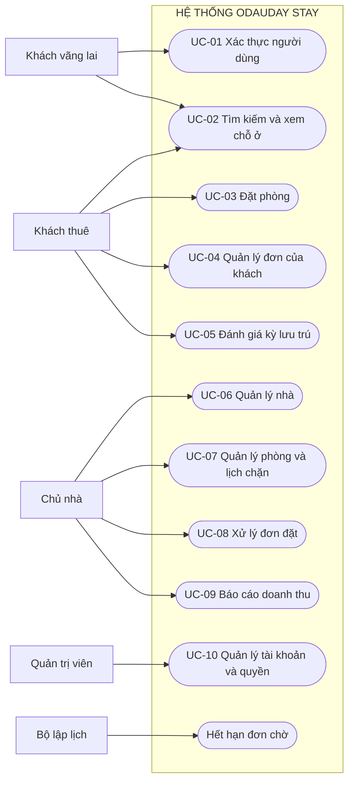
```mermaid
flowchart LR
    Visitor[Khách vãng lai]
    Guest[Khách thuê]
    Host[Chủ nhà]
    Admin[Quản trị viên]
    Scheduler[Bộ lập lịch]

    subgraph SYS[HỆ THỐNG ODAUDAY STAY]
        direction TB
        UC01([UC-01 Xác thực người dùng])
        UC02([UC-02 Tìm kiếm và xem chỗ ở])
        UC03([UC-03 Đặt phòng])
        UC04([UC-04 Quản lý đơn của khách])
        UC05([UC-05 Đánh giá kỳ lưu trú])
        UC06([UC-06 Quản lý nhà])
        UC07([UC-07 Quản lý phòng và lịch chặn])
        UC08([UC-08 Xử lý đơn đặt])
        UC09([UC-09 Báo cáo doanh thu])
        UC10([UC-10 Quản lý tài khoản và quyền])
        UCD([Hết hạn đơn chờ])
    end

    Visitor --> UC01
    Visitor --> UC02
    Guest --> UC02
    Guest --> UC03
    Guest --> UC04
    Guest --> UC05
    Host --> UC06
    Host --> UC07
    Host --> UC08
    Host --> UC09
    Admin --> UC10
    Scheduler --> UCD
```

Ghi chú: `Khách thuê`, `Chủ nhà` và `Quản trị viên` đều thực hiện `UC-01` trước khi dùng các chức năng cần đăng nhập. Liên kết này được lược khỏi hình tổng quát để giảm số đường giao nhau và đã ghi trong tiền điều kiện của từng đặc tả.

### 1.7.2. Quan hệ include và extend

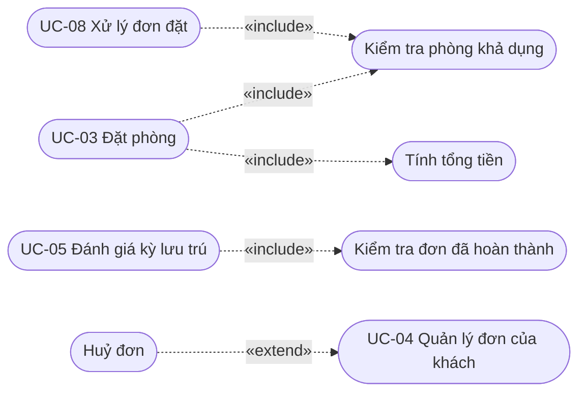
```mermaid
flowchart LR
    UC03([UC-03 Đặt phòng])
    UC04([UC-04 Quản lý đơn của khách])
    UC05([UC-05 Đánh giá kỳ lưu trú])
    UC08([UC-08 Xử lý đơn đặt])
    UCA([Kiểm tra phòng khả dụng])
    UCB([Tính tổng tiền])
    UCC([Kiểm tra đơn đã hoàn thành])
    UC041([Huỷ đơn])

    UC03 -. "«include»" .-> UCA
    UC03 -. "«include»" .-> UCB
    UC08 -. "«include»" .-> UCA
    UC05 -. "«include»" .-> UCC
    UC041 -. "«extend»" .-> UC04
```

**Giải thích ngữ nghĩa quan hệ**

- `UC-03 «include» Kiểm tra phòng khả dụng`: bước kiểm tra xung đột lịch là **bắt buộc** và được dùng lại, nên tách thành ca sử dụng chung.
- `UC-03 «include» Tính tổng tiền`: mọi lần đặt đều phải tính số đêm và tổng tiền.
- `UC-08 «include» Kiểm tra phòng khả dụng`: chủ nhà xác nhận đơn cũng phải kiểm tra lại khả dụng, dùng chung logic với `UC-03`.
- `UC-05 «include» Kiểm tra đơn đã hoàn thành`: điều kiện bắt buộc để được đánh giá.
- `Huỷ đơn «extend» UC-04`: huỷ là hành vi **tuỳ chọn**, chỉ xảy ra khi khách chủ động yêu cầu và đơn còn trong thời hạn cho phép, nên mở rộng từ ca sử dụng quản lý đơn.

## 1.8. Đặc tả Use Case dạng mở rộng

### UC-01 — Xác thực người dùng

| Thuộc tính | Nội dung |
|---|---|
| Tác nhân | Khách vãng lai, Khách thuê, Chủ nhà, Quản trị viên |
| Mục tiêu | Đăng ký tài khoản mới hoặc đăng nhập an toàn |
| Kích hoạt | Người dùng chọn Đăng ký hoặc Đăng nhập |
| Tiền điều kiện | Với đăng nhập: tài khoản đã tồn tại và chưa bị khoá |
| Hậu điều kiện thành công | Phiên đăng nhập được tạo; vai trò được nạp |
| Hậu điều kiện thất bại | Không tạo phiên; không thay đổi dữ liệu tài khoản |

**Luồng chính — đăng nhập**

1. Người dùng nhập tên đăng nhập và mật khẩu.
2. Hệ thống kiểm tra định dạng dữ liệu.
3. Hệ thống tìm tài khoản và đối chiếu mật khẩu đã băm.
4. Hệ thống kiểm tra trạng thái tài khoản.
5. Hệ thống tạo phiên/token và chuyển đến màn hình theo vai trò.

**Luồng thay thế/ngoại lệ**

- 3a. Sai tên đăng nhập hoặc mật khẩu: thông báo chung, không tiết lộ trường nào sai.
- 4a. Tài khoản bị khoá: từ chối đăng nhập và hướng dẫn liên hệ quản trị viên.
- Đăng ký: hệ thống kiểm tra tên đăng nhập/số điện thoại duy nhất, băm mật khẩu và tạo tài khoản vai trò `GUEST`.

### UC-02 — Tìm kiếm và xem chỗ ở

| Thuộc tính | Nội dung |
|---|---|
| Tác nhân | Khách vãng lai, Khách thuê |
| Mục tiêu | Tìm phòng phù hợp theo tiêu chí |
| Tiền điều kiện | Không yêu cầu đăng nhập |
| Hậu điều kiện | Danh sách/kết quả chi tiết được hiển thị; không thay đổi dữ liệu nghiệp vụ |

**Luồng chính**

1. Khách nhập từ khoá, địa chỉ, ngày đến/ngày đi, số khách và khoảng giá.
2. Hệ thống kiểm tra ngày đi lớn hơn ngày đến và bộ lọc hợp lệ.
3. Hệ thống tìm các phòng đang hoạt động, không trùng Booking giữ chỗ và không trùng RoomBlock.
4. Hệ thống trả kết quả phân trang cùng giá một đêm và điểm đánh giá trung bình.
5. Khách chọn một kết quả; hệ thống hiển thị nhà, phòng, ảnh, tiện ích cơ bản và đánh giá.

**Ngoại lệ:** ngày không hợp lệ → yêu cầu sửa; không có kết quả → hiển thị trạng thái rỗng và gợi ý nới bộ lọc.

### UC-03 — Đặt phòng

| Thuộc tính | Nội dung |
|---|---|
| Tác nhân | Khách thuê |
| Mục tiêu | Tạo đơn đặt cho một phòng còn trống |
| Tiền điều kiện | Đã đăng nhập; tài khoản hoạt động; phòng và nhà đang hoạt động |
| Hậu điều kiện thành công | Booking trạng thái `PENDING` được tạo; tổng tiền được cố định tại thời điểm đặt |
| Hậu điều kiện thất bại | Không tạo Booking và không giữ phòng |

**Luồng chính**

1. Khách chọn phòng, ngày đến/ngày đi, số người lớn và trẻ em.
2. Hệ thống xác thực dữ liệu và sức chứa.
3. Hệ thống kiểm tra khoảng ngày không trùng đơn `PENDING/CONFIRMED/CHECKED_IN` hoặc lịch chặn.
4. Hệ thống tính số đêm và tổng tiền theo giá hiện tại của phòng.
5. Hệ thống hiển thị bản tóm tắt để khách xác nhận.
6. Khách xác nhận đặt.
7. Hệ thống kiểm tra khả dụng lần cuối trong giao dịch CSDL và tạo Booking `PENDING`.
8. Hệ thống thông báo mã đơn và thời hạn chờ chủ nhà xác nhận.

**Ngoại lệ**

- 2a. Số khách vượt sức chứa hoặc ngày không hợp lệ: từ chối và chỉ rõ dữ liệu cần sửa.
- 3a/7a. Phòng vừa được người khác đặt hoặc bị chặn: không tạo đơn, đề nghị chọn ngày/phòng khác.
- 6a. Khách huỷ thao tác: không thay đổi dữ liệu.

### UC-04 — Quản lý và huỷ đơn của khách

| Thuộc tính | Nội dung |
|---|---|
| Tác nhân | Khách thuê |
| Mục tiêu | Xem lịch sử/chi tiết và huỷ đơn hợp lệ |
| Tiền điều kiện | Đã đăng nhập; chỉ truy cập đơn do chính tài khoản tạo |
| Hậu điều kiện | Nếu huỷ hợp lệ, trạng thái đổi thành `CANCELLED` và lưu thời điểm/lý do |

**Luồng chính:** khách mở danh sách đơn → hệ thống lọc theo tài khoản → khách xem chi tiết → chọn Huỷ → hệ thống kiểm tra trạng thái/chính sách → khách xác nhận → hệ thống huỷ đơn.

**Ngoại lệ:** đơn đã huỷ/từ chối/hoàn thành hoặc đã nhận phòng → không cho huỷ; quá hạn huỷ → từ chối và hiển thị chính sách.

### UC-05 — Đánh giá kỳ lưu trú

| Thuộc tính | Nội dung |
|---|---|
| Tác nhân | Khách thuê |
| Mục tiêu | Đánh giá một kỳ lưu trú thực tế |
| Tiền điều kiện | Booking thuộc khách, trạng thái `COMPLETED`, chưa có Review |
| Hậu điều kiện | Một Review có điểm 1–5 và nội dung hợp lệ được tạo |

**Luồng chính:** khách chọn đơn hoàn thành → nhập điểm và bình luận → hệ thống kiểm tra quyền/điểm/nội dung → tạo Review → cập nhật điểm trung bình hiển thị.

**Ngoại lệ:** chưa hoàn thành hoặc đã đánh giá → từ chối; điểm ngoài 1–5/nội dung quá dài → yêu cầu sửa.

### UC-06 — Quản lý nhà

| Thuộc tính | Nội dung |
|---|---|
| Tác nhân | Chủ nhà |
| Mục tiêu | Tạo, sửa, đăng/ẩn nhà và quản lý ảnh |
| Tiền điều kiện | Đã đăng nhập với vai trò `HOST` |
| Hậu điều kiện | Thông tin nhà hợp lệ được lưu; thay đổi trạng thái có hiệu lực |

**Luồng chính:** chủ nhà mở danh sách → tạo hoặc chọn nhà → nhập tên, loại, địa chỉ, mô tả → thêm ảnh → lưu nháp → thêm ít nhất một phòng → đăng nhà.

**Ngoại lệ:** dữ liệu thiếu/ảnh sai định dạng → từ chối; chủ nhà sửa nhà không thuộc sở hữu → trả 403; không cho xoá cứng nhà đã có Booking, chỉ cho chuyển `INACTIVE`.

### UC-07 — Quản lý phòng và lịch chặn

| Thuộc tính | Nội dung |
|---|---|
| Tác nhân | Chủ nhà |
| Mục tiêu | Quản lý phòng, giá, sức chứa, trạng thái và thời gian bảo trì |
| Tiền điều kiện | Nhà thuộc chủ nhà |
| Hậu điều kiện | Room hoặc RoomBlock hợp lệ được lưu |

**Luồng chính:** chủ nhà chọn nhà → thêm/sửa phòng → nhập tên, sức chứa, giá → lưu → khi cần chọn khoảng ngày và lý do để chặn phòng.

**Ngoại lệ:** giá/sức chứa không dương → từ chối; khoảng chặn trùng Booking đã xác nhận/nhận phòng → từ chối; khoảng chặn giao nhau → yêu cầu gộp hoặc chọn lại.

### UC-08 — Xử lý đơn đặt

| Thuộc tính | Nội dung |
|---|---|
| Tác nhân | Chủ nhà |
| Mục tiêu | Xác nhận/từ chối đơn và cập nhật quá trình lưu trú |
| Tiền điều kiện | Booking thuộc phòng trong nhà của chủ nhà |
| Hậu điều kiện | Booking chuyển trạng thái hợp lệ và ghi thời điểm cập nhật |

**Luồng chính:** chủ nhà mở đơn `PENDING` → xem chi tiết → chọn Xác nhận → hệ thống kiểm tra phòng lần cuối → chuyển `CONFIRMED`; đến ngày khách tới, chủ nhà Check-in → `CHECKED_IN`; khi trả phòng, chủ nhà Hoàn thành → `COMPLETED`.

**Ngoại lệ:** phòng không còn khả dụng → từ chối xác nhận; chủ nhà có thể từ chối đơn `PENDING` kèm lý do; mọi chuyển trạng thái trái state machine đều bị chặn.

### UC-09 — Xem báo cáo doanh thu

| Thuộc tính | Nội dung |
|---|---|
| Tác nhân | Chủ nhà |
| Mục tiêu | Xem doanh thu theo tháng và theo nhà |
| Tiền điều kiện | Đã đăng nhập vai trò `HOST` |
| Hậu điều kiện | Báo cáo được hiển thị; không thay đổi dữ liệu |

Hệ thống chỉ cộng `total_amount` của Booking `COMPLETED`, thuộc nhà của chủ tài khoản, theo tháng hoàn thành. Chủ nhà có thể lọc theo nhà và khoảng tháng. Tháng không có dữ liệu trả về doanh thu 0.

### UC-10 — Quản lý tài khoản và quyền

| Thuộc tính | Nội dung |
|---|---|
| Tác nhân | Quản trị viên |
| Mục tiêu | Tìm tài khoản, cấp vai trò, khoá hoặc mở khoá |
| Tiền điều kiện | Đã đăng nhập vai trò `ADMIN` |
| Hậu điều kiện | Vai trò/trạng thái mới được lưu và ghi nhận thời điểm cập nhật |

Quản trị viên không được tự khoá tài khoản đang đăng nhập và không được loại bỏ quản trị viên cuối cùng. Tài khoản bị khoá không thể tạo phiên mới.

## 1.9. Quy tắc nghiệp vụ

| ID | Quy tắc |
|---|---|
| BR-01 | `checkOutDate` phải sau `checkInDate`; số đêm = chênh lệch ngày |
| BR-02 | Người lớn ≥ 1, trẻ em ≥ 0 và tổng khách ≤ sức chứa phòng |
| BR-03 | Hai khoảng ngày xung đột khi `startA < endB AND endA > startB` |
| BR-04 | Phòng không được có hai Booking giữ chỗ trùng thời gian |
| BR-05 | `totalAmount = numberOfNights × pricePerNightSnapshot` |
| BR-06 | Chỉ chủ sở hữu nhà được quản lý nhà/phòng và xử lý đơn liên quan |
| BR-07 | Chỉ Booking `COMPLETED` mới được đánh giá; mỗi Booking tối đa một Review |
| BR-08 | Doanh thu chỉ tính Booking `COMPLETED` |
| BR-09 | Không xoá cứng dữ liệu đã phát sinh giao dịch; dùng trạng thái `INACTIVE` |
| BR-10 | Mọi chuyển trạng thái Booking phải tuân theo state machine tại mục 3.3.4 |

## 1.10. Yêu cầu phi chức năng

| Nhóm | Mã | Yêu cầu đo lường được |
|---|---|---|
| Hiệu năng | NFR-01 | 95% yêu cầu tìm kiếm phản hồi ≤ 2 giây với 100 người dùng đồng thời và 100.000 phòng |
| Hiệu năng | NFR-02 | Tạo Booking phản hồi ≤ 3 giây, không tạo trùng đơn trong điều kiện cạnh tranh |
| Sẵn sàng | NFR-03 | Mục tiêu uptime 99,5%/tháng, không tính bảo trì đã thông báo |
| Bảo mật | NFR-04 | Mật khẩu được băm bằng thuật toán thích hợp; không lưu hoặc ghi log mật khẩu thô |
| Bảo mật | NFR-05 | Kiểm soát truy cập theo vai trò và quyền sở hữu ở phía server cho mọi API thay đổi dữ liệu |
| Bảo mật | NFR-06 | Bắt buộc HTTPS khi triển khai; token/phiên hết hạn và chống CSRF nếu dùng cookie |
| Toàn vẹn | NFR-07 | Tạo/xác nhận Booking và kiểm tra khả dụng thực hiện trong transaction |
| Khả dụng | NFR-08 | Giao diện responsive từ 360 px; thao tác chính có nhãn và thông báo lỗi cụ thể |
| Tương thích | NFR-09 | Hỗ trợ hai phiên bản ổn định gần nhất của Chrome, Edge, Firefox và Safari |
| Bảo trì | NFR-10 | Tách Presentation/Application/Domain/Infrastructure; domain không phụ thuộc UI/CSDL cụ thể |
| Sao lưu | NFR-11 | Sao lưu CSDL hằng ngày; RPO ≤ 24 giờ, RTO mục tiêu ≤ 4 giờ |
| Riêng tư | NFR-12 | Chỉ hiển thị số điện thoại cho bên có Booking liên quan và chỉ trong thời gian cần thiết |

---

# Chương 2 — Phân tích đối tượng

## 2.1. Phân tích danh từ và lớp ứng viên

| Danh từ ứng viên | Quyết định | Lý do |
|---|---|---|
| Người dùng | Giữ — `User` | Có dữ liệu, trạng thái và hành vi xác thực/quyền |
| Vai trò | Giữ — `Role` | Quy định quyền của tài khoản |
| Nhà | Giữ — `Property` | Thực thể bền vững, chứa phòng và ảnh |
| Loại nhà | Giữ — `PropertyType` | Phân loại nhiều nhà |
| Phòng | Giữ — `Room` | Đơn vị được đặt, có giá và sức chứa |
| Đơn đặt | Giữ — `Booking` | Lớp liên kết Guest–Room có ngày, tiền và vòng đời |
| Đánh giá/bình luận | Gộp — `Review` | Cùng vòng đời, cùng tác giả và đối tượng; tránh hai lớp trùng trách nhiệm |
| Ảnh | Giữ — `Photo` | Có đường dẫn, thứ tự, chú thích và thuộc một nhà |
| Khoảng bảo trì/chặn lịch | Giữ — `RoomBlock` | Có vòng đời và ảnh hưởng đến khả dụng |
| Trạng thái | Dùng kiểu liệt kê | Không cần lớp nghiệp vụ độc lập trong conceptual model |
| Form, nút, trang web | Loại | Chi tiết giao diện, thuộc Boundary |
| Database, session, API | Loại | Chi tiết kỹ thuật, không phải thực thể miền |
| Báo cáo doanh thu | Không là Entity | Dữ liệu dẫn xuất; do Application Service tổng hợp |

## 2.2. Mô hình khái niệm

Mô hình khái niệm chỉ biểu diễn khái niệm miền, quan hệ và bội số; **không đưa khoá chính, kiểu dữ liệu hoặc chi tiết CSDL**.

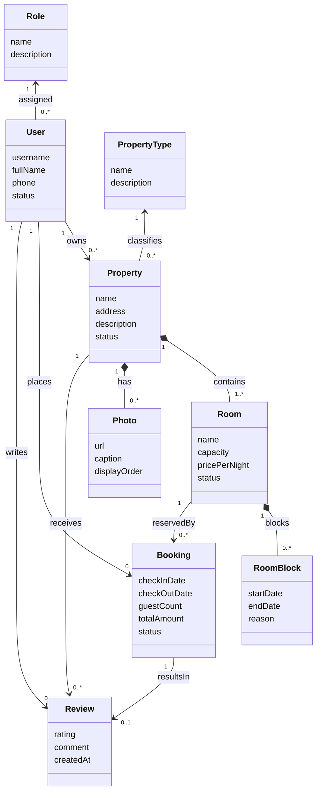
```mermaid
classDiagram
    class User {
        username
        fullName
        phone
        status
    }
    class Role {
        name
        description
    }
    class PropertyType {
        name
        description
    }
    class Property {
        name
        address
        description
        status
    }
    class Room {
        name
        capacity
        pricePerNight
        status
    }
    class Photo {
        url
        caption
        displayOrder
    }
    class RoomBlock {
        startDate
        endDate
        reason
    }
    class Booking {
        checkInDate
        checkOutDate
        guestCount
        totalAmount
        status
    }
    class Review {
        rating
        comment
        createdAt
    }

    Role "1" <-- "0..*" User : assigned
    User "1" --> "0..*" Property : owns
    PropertyType "1" <-- "0..*" Property : classifies
    Property "1" *-- "1..*" Room : contains
    Property "1" *-- "0..*" Photo : has
    Room "1" *-- "0..*" RoomBlock : blocks
    User "1" --> "0..*" Booking : places
    Room "1" --> "0..*" Booking : reservedBy
    Booking "1" --> "0..1" Review : resultsIn
    User "1" --> "0..*" Review : writes
    Property "1" --> "0..*" Review : receives
```

`Booking` là **association class** của quan hệ Khách thuê–Phòng vì quan hệ này cần lưu ngày đến, ngày đi, số khách, tổng tiền và trạng thái.

## 2.3. Thẻ CRC

| Class | Responsibilities — Trách nhiệm | Collaborators — Cộng tác viên |
|---|---|---|
| `User` | Giữ hồ sơ/trạng thái; kiểm tra khả năng đăng nhập; xác định vai trò | `Role`, `Booking`, `Property`, `Review` |
| `Property` | Giữ thông tin nhà; quản lý tập phòng/ảnh; kiểm tra quyền sở hữu; đăng/ẩn nhà | `User`, `PropertyType`, `Room`, `Photo` |
| `Room` | Giữ giá/sức chứa/trạng thái; kiểm tra sức chứa và khả dụng theo lịch | `Property`, `Booking`, `RoomBlock` |
| `Booking` | Kiểm tra ngày/số khách; chụp giá; tính tổng; quản lý chuyển trạng thái | `User`, `Room`, `Review` |
| `Review` | Bảo đảm điểm 1–5; gắn đánh giá với một kỳ lưu trú hoàn thành | `Booking`, `User`, `Property` |
| `RoomBlock` | Biểu diễn khoảng phòng không nhận đặt; kiểm tra giao nhau | `Room`, `Booking` |
| `Photo` | Giữ ảnh, chú thích và thứ tự hiển thị | `Property` |
| `Role` | Mô tả vai trò/quyền nghiệp vụ | `User` |
| `BookingService` | Điều phối UC đặt phòng trong transaction, xử lý cạnh tranh | `Booking`, `Room`, repositories |
| `RevenueService` | Tổng hợp doanh thu hoàn thành theo chủ nhà/tháng | `BookingRepository`, `PropertyRepository` |

## 2.4. System Sequence Diagram (SSD)

SSD chỉ coi ODauDay Stay là một hộp đen, chưa thể hiện lớp nội bộ.

### 2.4.1. SSD — Đặt phòng

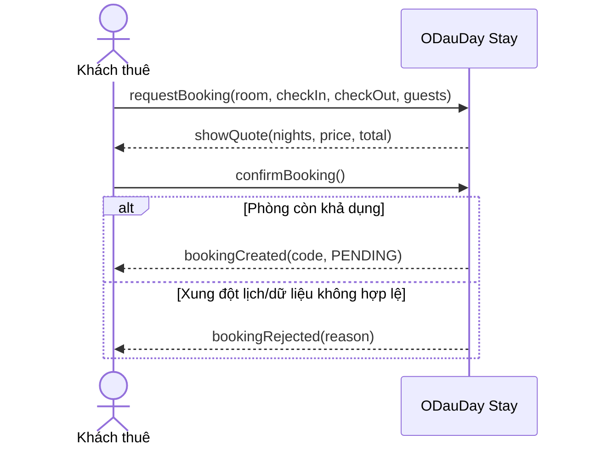
```mermaid
sequenceDiagram
    actor Guest as Khách thuê
    participant System as ODauDay Stay
    Guest->>System: requestBooking(room, checkIn, checkOut, guests)
    System-->>Guest: showQuote(nights, price, total)
    Guest->>System: confirmBooking()
    alt Phòng còn khả dụng
        System-->>Guest: bookingCreated(code, PENDING)
    else Xung đột lịch/dữ liệu không hợp lệ
        System-->>Guest: bookingRejected(reason)
    end
```

### 2.4.2. SSD — Chủ nhà xác nhận đơn

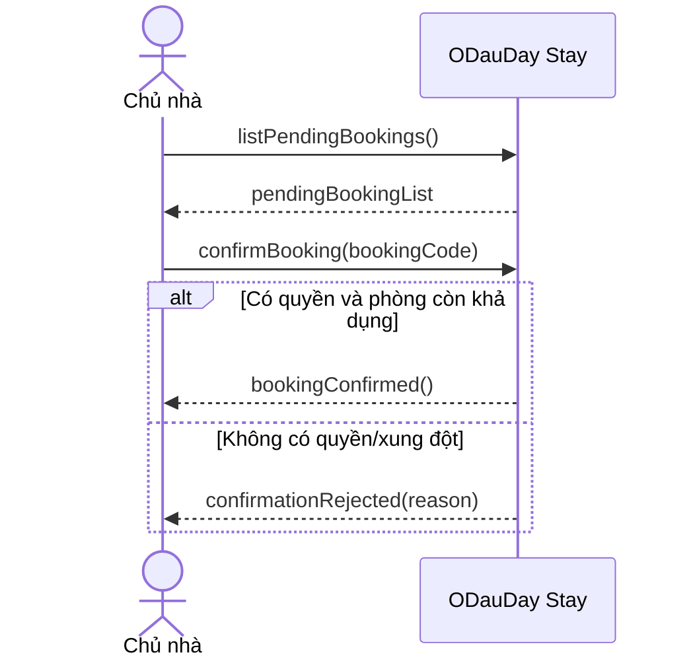
```mermaid
sequenceDiagram
    actor Host as Chủ nhà
    participant System as ODauDay Stay
    Host->>System: listPendingBookings()
    System-->>Host: pendingBookingList
    Host->>System: confirmBooking(bookingCode)
    alt Có quyền và phòng còn khả dụng
        System-->>Host: bookingConfirmed()
    else Không có quyền/xung đột
        System-->>Host: confirmationRejected(reason)
    end
```

### 2.4.3. SSD — Đánh giá

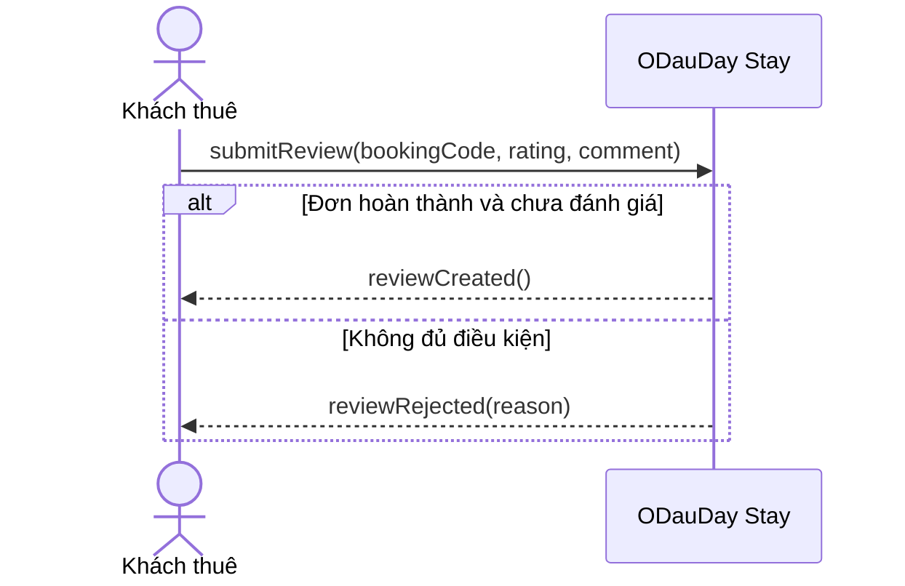
```mermaid
sequenceDiagram
    actor Guest as Khách thuê
    participant System as ODauDay Stay
    Guest->>System: submitReview(bookingCode, rating, comment)
    alt Đơn hoàn thành và chưa đánh giá
        System-->>Guest: reviewCreated()
    else Không đủ điều kiện
        System-->>Guest: reviewRejected(reason)
    end
```

---

# Chương 3 — Thiết kế hệ thống

## 3.1. Kiến trúc phân tầng

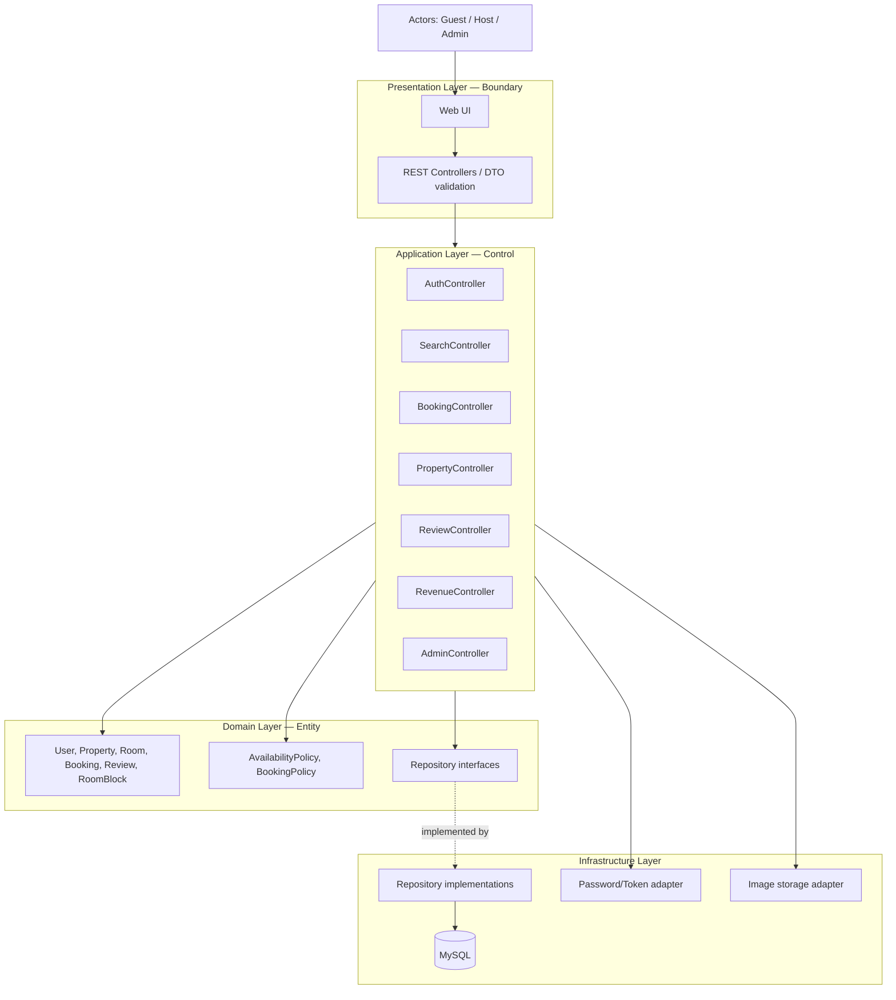
```mermaid
flowchart TB
    Actor[Actors: Guest / Host / Admin]

    subgraph Presentation[Presentation Layer — Boundary]
        Web[Web UI]
        API[REST Controllers / DTO validation]
    end

    subgraph Application[Application Layer — Control]
        AuthC[AuthController]
        SearchC[SearchController]
        BookingC[BookingController]
        PropertyC[PropertyController]
        ReviewC[ReviewController]
        RevenueC[RevenueController]
        AdminC[AdminController]
    end

    subgraph Domain[Domain Layer — Entity]
        Entities[User, Property, Room, Booking, Review, RoomBlock]
        Policies[AvailabilityPolicy, BookingPolicy]
        RepoPorts[Repository interfaces]
    end

    subgraph Infrastructure[Infrastructure Layer]
        RepoImpl[Repository implementations]
        DB[(MySQL)]
        Security[Password/Token adapter]
        Storage[Image storage adapter]
    end

    Actor --> Web
    Web --> API
    API --> Application
    Application --> Entities
    Application --> Policies
    Application --> RepoPorts
    RepoPorts -. implemented by .-> RepoImpl
    RepoImpl --> DB
    Application --> Security
    Application --> Storage
```

**Quy tắc phụ thuộc:** Presentation phụ thuộc Application; Application phụ thuộc Domain; Infrastructure hiện thực abstraction do Domain/Application định nghĩa. Entity không gọi ngược lên Control hoặc Boundary.

## 3.2. Sơ đồ lớp BCE

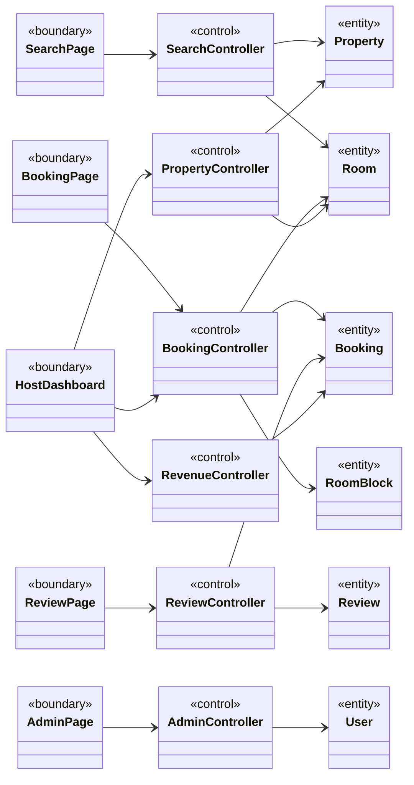
```mermaid
classDiagram
    direction LR

    class SearchPage { <<boundary>> }
    class BookingPage { <<boundary>> }
    class HostDashboard { <<boundary>> }
    class ReviewPage { <<boundary>> }
    class AdminPage { <<boundary>> }

    class SearchController { <<control>> }
    class BookingController { <<control>> }
    class PropertyController { <<control>> }
    class ReviewController { <<control>> }
    class RevenueController { <<control>> }
    class AdminController { <<control>> }

    class User { <<entity>> }
    class Property { <<entity>> }
    class Room { <<entity>> }
    class Booking { <<entity>> }
    class Review { <<entity>> }
    class RoomBlock { <<entity>> }

    SearchPage --> SearchController
    BookingPage --> BookingController
    HostDashboard --> PropertyController
    HostDashboard --> BookingController
    HostDashboard --> RevenueController
    ReviewPage --> ReviewController
    AdminPage --> AdminController

    SearchController --> Property
    SearchController --> Room
    BookingController --> Booking
    BookingController --> Room
    BookingController --> RoomBlock
    PropertyController --> Property
    PropertyController --> Room
    ReviewController --> Review
    ReviewController --> Booking
    RevenueController --> Booking
    AdminController --> User
```

## 3.3. Thiết kế chi tiết

### 3.3.1. Sequence Diagram — Đặt phòng theo BCE

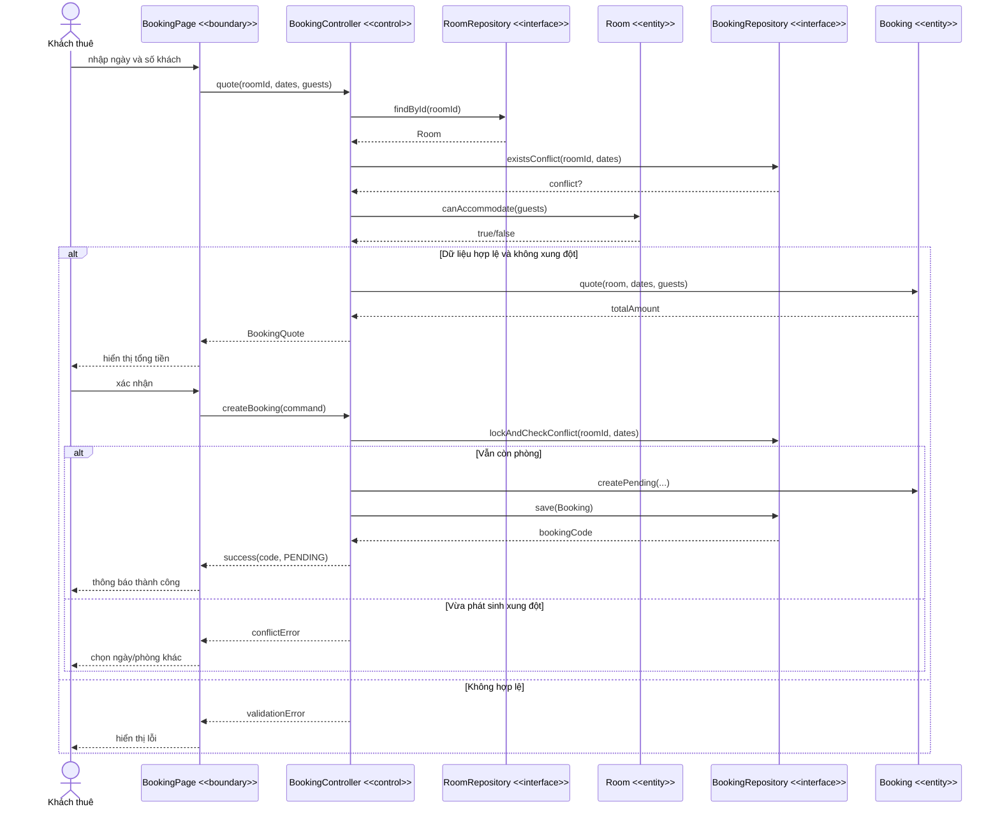
```mermaid
sequenceDiagram
    actor Guest as Khách thuê
    participant Page as BookingPage <<boundary>>
    participant C as BookingController <<control>>
    participant RRepo as RoomRepository <<interface>>
    participant Room as Room <<entity>>
    participant BRepo as BookingRepository <<interface>>
    participant Booking as Booking <<entity>>

    Guest->>Page: nhập ngày và số khách
    Page->>C: quote(roomId, dates, guests)
    C->>RRepo: findById(roomId)
    RRepo-->>C: Room
    C->>BRepo: existsConflict(roomId, dates)
    BRepo-->>C: conflict?
    C->>Room: canAccommodate(guests)
    Room-->>C: true/false

    alt Dữ liệu hợp lệ và không xung đột
        C->>Booking: quote(room, dates, guests)
        Booking-->>C: totalAmount
        C-->>Page: BookingQuote
        Page-->>Guest: hiển thị tổng tiền
        Guest->>Page: xác nhận
        Page->>C: createBooking(command)
        C->>BRepo: lockAndCheckConflict(roomId, dates)
        alt Vẫn còn phòng
            C->>Booking: createPending(...)
            C->>BRepo: save(Booking)
            BRepo-->>C: bookingCode
            C-->>Page: success(code, PENDING)
            Page-->>Guest: thông báo thành công
        else Vừa phát sinh xung đột
            C-->>Page: conflictError
            Page-->>Guest: chọn ngày/phòng khác
        end
    else Không hợp lệ
        C-->>Page: validationError
        Page-->>Guest: hiển thị lỗi
    end
```

### 3.3.2. Sequence Diagram — Chủ nhà xác nhận đơn

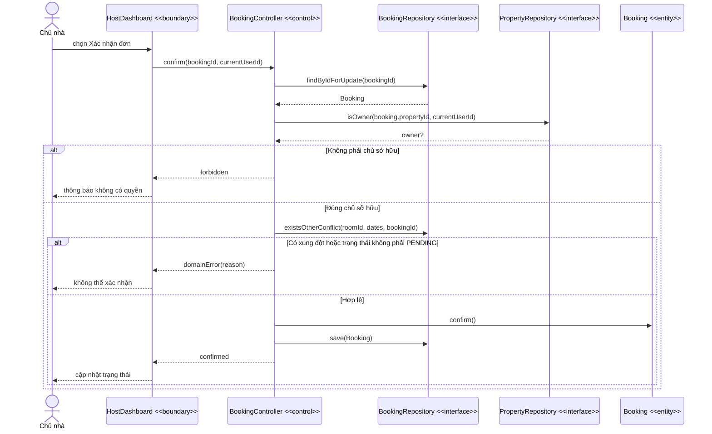
```mermaid
sequenceDiagram
    actor Host as Chủ nhà
    participant UI as HostDashboard <<boundary>>
    participant C as BookingController <<control>>
    participant BRepo as BookingRepository <<interface>>
    participant PRepo as PropertyRepository <<interface>>
    participant Booking as Booking <<entity>>

    Host->>UI: chọn Xác nhận đơn
    UI->>C: confirm(bookingId, currentUserId)
    C->>BRepo: findByIdForUpdate(bookingId)
    BRepo-->>C: Booking
    C->>PRepo: isOwner(booking.propertyId, currentUserId)
    PRepo-->>C: owner?

    alt Không phải chủ sở hữu
        C-->>UI: forbidden
        UI-->>Host: thông báo không có quyền
    else Đúng chủ sở hữu
        C->>BRepo: existsOtherConflict(roomId, dates, bookingId)
        alt Có xung đột hoặc trạng thái không phải PENDING
            C-->>UI: domainError(reason)
            UI-->>Host: không thể xác nhận
        else Hợp lệ
            C->>Booking: confirm()
            C->>BRepo: save(Booking)
            C-->>UI: confirmed
            UI-->>Host: cập nhật trạng thái
        end
    end
```

### 3.3.3. Sequence Diagram — Đánh giá kỳ lưu trú

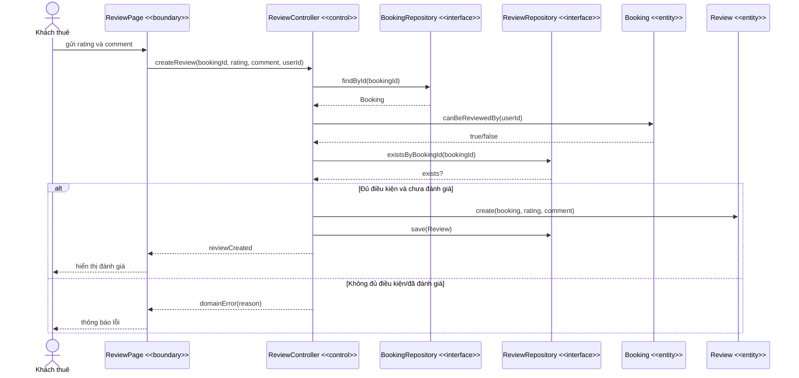
```mermaid
sequenceDiagram
    actor Guest as Khách thuê
    participant UI as ReviewPage <<boundary>>
    participant C as ReviewController <<control>>
    participant BRepo as BookingRepository <<interface>>
    participant RRepo as ReviewRepository <<interface>>
    participant Booking as Booking <<entity>>
    participant Review as Review <<entity>>

    Guest->>UI: gửi rating và comment
    UI->>C: createReview(bookingId, rating, comment, userId)
    C->>BRepo: findById(bookingId)
    BRepo-->>C: Booking
    C->>Booking: canBeReviewedBy(userId)
    Booking-->>C: true/false
    C->>RRepo: existsByBookingId(bookingId)
    RRepo-->>C: exists?

    alt Đủ điều kiện và chưa đánh giá
        C->>Review: create(booking, rating, comment)
        C->>RRepo: save(Review)
        C-->>UI: reviewCreated
        UI-->>Guest: hiển thị đánh giá
    else Không đủ điều kiện/đã đánh giá
        C-->>UI: domainError(reason)
        UI-->>Guest: thông báo lỗi
    end
```

### 3.3.4. State Machine — Booking

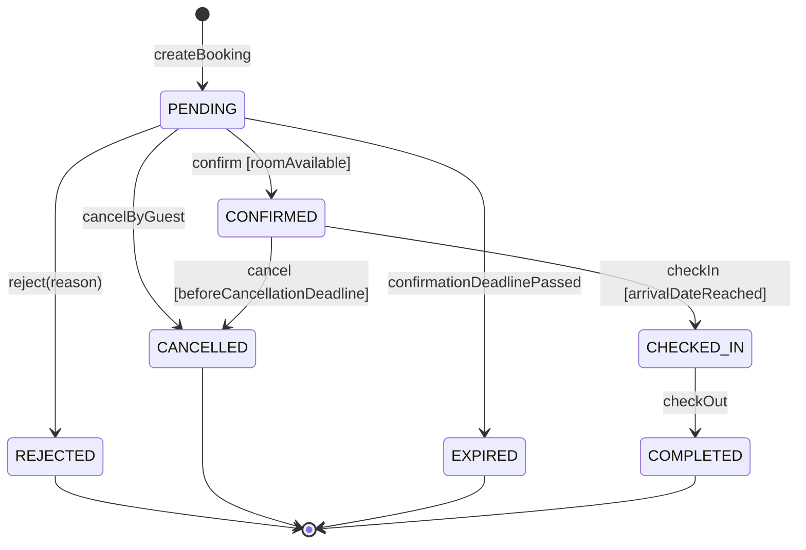
```mermaid
stateDiagram-v2
    [*] --> PENDING: createBooking
    PENDING --> CONFIRMED: confirm [roomAvailable]
    PENDING --> REJECTED: reject(reason)
    PENDING --> CANCELLED: cancelByGuest
    PENDING --> EXPIRED: confirmationDeadlinePassed
    CONFIRMED --> CHECKED_IN: checkIn [arrivalDateReached]
    CONFIRMED --> CANCELLED: cancel [beforeCancellationDeadline]
    CHECKED_IN --> COMPLETED: checkOut
    REJECTED --> [*]
    CANCELLED --> [*]
    EXPIRED --> [*]
    COMPLETED --> [*]
```

Các chuyển trạng thái ngoài sơ đồ bị từ chối bằng `InvalidBookingStateException`. Trạng thái đầu là `PENDING`; các trạng thái kết thúc là `REJECTED`, `CANCELLED`, `EXPIRED`, `COMPLETED`.

### 3.3.5. Design Class Diagram (DCD)


```mermaid
classDiagram
    direction TB

    class User {
        -Long id
        -Long roleId
        -String username
        -String passwordHash
        -String fullName
        -String phone
        -UserStatus status
        -Instant createdAt
        +boolean isActive()
        +boolean hasRole(RoleName role)
        +void lock()
        +void unlock()
    }

    class Role {
        -Long id
        -RoleName name
        -String description
    }

    class PropertyType {
        -Long id
        -String name
        -String description
    }

    class Property {
        -Long id
        -Long ownerId
        -Long propertyTypeId
        -String name
        -String address
        -String description
        -PropertyStatus status
        -Instant createdAt
        +void updateDetails(PropertyDetails details)
        +void publish()
        +void deactivate()
        +boolean isOwnedBy(Long userId)
    }

    class Room {
        -Long id
        -Long propertyId
        -String name
        -int capacity
        -Decimal pricePerNight
        -RoomStatus status
        +boolean canAccommodate(int guests)
        +Money quote(LocalDate from, LocalDate to)
        +void changePrice(Decimal newPrice)
        +void activate()
        +void deactivate()
    }

    class Photo {
        -Long id
        -Long propertyId
        -String url
        -String caption
        -int displayOrder
        +void reorder(int newOrder)
    }

    class RoomBlock {
        -Long id
        -Long roomId
        -LocalDate startDate
        -LocalDate endDate
        -String reason
        +boolean overlaps(DateRange range)
        +void validate()
    }

    class Booking {
        -Long id
        -String code
        -Long guestId
        -Long roomId
        -LocalDate checkInDate
        -LocalDate checkOutDate
        -int adults
        -int children
        -Decimal pricePerNightSnapshot
        -Decimal totalAmount
        -BookingStatus status
        -String cancellationReason
        -Instant createdAt
        -Instant updatedAt
        +Booking createPending(User guest, Room room, BookingRequest req)
        +int numberOfNights()
        +void calculateTotal()
        +void confirm()
        +void reject(String reason)
        +void cancel(User actor, String reason)
        +void checkIn()
        +void complete()
        +void expire()
        +boolean canBeReviewedBy(Long userId)
    }

    class Review {
        -Long id
        -Long bookingId
        -Long guestId
        -Long propertyId
        -int rating
        -String comment
        -Instant createdAt
        +Review create(Booking booking, int rating, String comment)
        +void validateRating()
    }

    class BookingController {
        -BookingRepository bookings
        -RoomRepository rooms
        -AvailabilityService availability
        +BookingQuote quote(BookingCommand cmd)
        +BookingDTO createBooking(BookingCommand cmd)
        +void confirm(Long bookingId, Long actorId)
        +void cancel(Long bookingId, Long actorId, String reason)
    }

    class ReviewController {
        -BookingRepository bookings
        -ReviewRepository reviews
        +ReviewDTO createReview(ReviewCommand cmd)
    }

    class RevenueService {
        -BookingRepository bookings
        +MonthlyRevenue report(Long hostId, YearMonth month, Long propertyId)
    }

    class AvailabilityService {
        -BookingRepository bookings
        -RoomBlockRepository blocks
        +boolean isAvailable(Long roomId, DateRange range, Long excludedBookingId)
    }

    class BookingRepository {
        <<interface>>
        +Booking findById(Long id)
        +Booking save(Booking booking)
        +boolean existsConflict(Long roomId, DateRange range, Long excludedId)
        +MonthlyRevenue aggregateRevenue(Long hostId, YearMonth month, Long propertyId)
    }

    class RoomRepository {
        <<interface>>
        +Room findById(Long id)
        +Room save(Room room)
    }

    class ReviewRepository {
        <<interface>>
        +boolean existsByBookingId(Long bookingId)
        +Review save(Review review)
    }

    class UserRepository {
        <<interface>>
        +User findById(Long id)
        +User findByUsername(String username)
        +boolean existsByUsername(String username)
        +User save(User user)
    }

    class PropertyRepository {
        <<interface>>
        +Property findById(Long id)
        +List~PropertySummary~ search(SearchCriteria criteria)
        +boolean isOwner(Long propertyId, Long userId)
        +Property save(Property property)
    }

    class RoomBlockRepository {
        <<interface>>
        +boolean existsConflict(Long roomId, DateRange range)
        +RoomBlock save(RoomBlock block)
    }

    class PasswordHasher {
        <<interface>>
        +String hash(String rawPassword)
        +boolean matches(String rawPassword, String passwordHash)
    }

    class AuthController {
        -UserRepository users
        -PasswordHasher passwordHasher
        +AuthResult login(LoginCommand cmd)
        +UserDTO register(RegisterCommand cmd)
    }

    class SearchController {
        -PropertyRepository properties
        -AvailabilityService availability
        +Page~PropertySummary~ search(SearchCriteria criteria)
        +PropertyDetails getDetails(Long propertyId)
    }

    class PropertyController {
        -PropertyRepository properties
        -RoomRepository rooms
        -RoomBlockRepository blocks
        +PropertyDTO createProperty(PropertyCommand cmd)
        +PropertyDTO updateProperty(Long id, PropertyCommand cmd)
        +RoomDTO saveRoom(Long propertyId, RoomCommand cmd)
        +RoomBlockDTO blockRoom(Long roomId, BlockRoomCommand cmd)
    }

    class RevenueController {
        -RevenueService revenueService
        +MonthlyRevenue getMonthlyReport(Long hostId, YearMonth month, Long propertyId)
    }

    class AdminController {
        -UserRepository users
        +void changeRole(Long userId, RoleName role)
        +void lockUser(Long userId)
        +void unlockUser(Long userId)
    }

    class RoleName {
        <<enumeration>>
        ADMIN
        HOST
        GUEST
    }

    class UserStatus {
        <<enumeration>>
        ACTIVE
        LOCKED
        INACTIVE
    }

    class PropertyStatus {
        <<enumeration>>
        DRAFT
        PUBLISHED
        INACTIVE
    }

    class RoomStatus {
        <<enumeration>>
        ACTIVE
        INACTIVE
        MAINTENANCE
    }

    class BookingStatus {
        <<enumeration>>
        PENDING
        CONFIRMED
        REJECTED
        CANCELLED
        EXPIRED
        CHECKED_IN
        COMPLETED
    }

    Role "1" <-- "0..*" User
    User "1" --> "0..*" Property : owner
    PropertyType "1" <-- "0..*" Property
    Property "1" *-- "1..*" Room
    Property "1" *-- "0..*" Photo
    Room "1" *-- "0..*" RoomBlock
    User "1" --> "0..*" Booking : guest
    Room "1" --> "0..*" Booking
    Booking "1" --> "0..1" Review
    Property "1" --> "0..*" Review

    BookingController --> BookingRepository
    BookingController --> RoomRepository
    BookingController --> AvailabilityService
    ReviewController --> BookingRepository
    ReviewController --> ReviewRepository
    AuthController --> UserRepository
    AuthController --> PasswordHasher
    SearchController --> PropertyRepository
    SearchController --> AvailabilityService
    PropertyController --> PropertyRepository
    PropertyController --> RoomRepository
    PropertyController --> RoomBlockRepository
    RevenueController --> RevenueService
    AdminController --> UserRepository
    RevenueService --> BookingRepository
    AvailabilityService --> BookingRepository
    AvailabilityService --> RoomBlockRepository

    User --> UserStatus
    Role --> RoleName
    Property --> PropertyStatus
    Room --> RoomStatus
    Booking --> BookingStatus
```

## 3.4. Thiết kế cơ sở dữ liệu

### 3.4.1. Quy tắc chuyển đổi

| Mô hình lớp | Mô hình quan hệ |
|---|---|
| Entity có vòng đời độc lập | Một bảng có khoá chính |
| Quan hệ Role 1–n User | `users.role_id` là khoá ngoại |
| User 1–n Property | `properties.owner_id` là khoá ngoại |
| Property 1–n Room/Photo | Khoá ngoại đặt ở `rooms`/`photos` |
| Guest–Room có dữ liệu quan hệ | Bảng liên kết có thuộc tính `bookings` |
| Booking 1–0..1 Review | `reviews.booking_id` vừa FK vừa UNIQUE |
| Trạng thái | Cột `VARCHAR` + `CHECK`, không tạo bảng vô nghĩa |
| Kế thừa vai trò | Dùng bảng `roles`, không dùng bảng con Guest/Host/Admin |

### 3.4.2. ERD

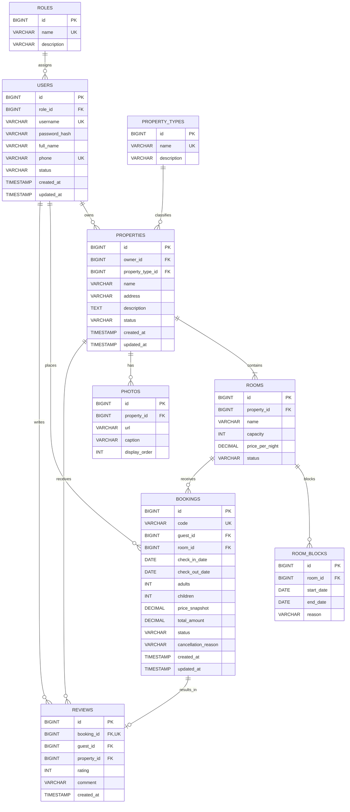
```mermaid
erDiagram
    ROLES ||--o{ USERS : assigns
    USERS ||--o{ PROPERTIES : owns
    PROPERTY_TYPES ||--o{ PROPERTIES : classifies
    PROPERTIES ||--|{ ROOMS : contains
    PROPERTIES ||--o{ PHOTOS : has
    ROOMS ||--o{ ROOM_BLOCKS : blocks
    USERS ||--o{ BOOKINGS : places
    ROOMS ||--o{ BOOKINGS : receives
    BOOKINGS ||--o| REVIEWS : results_in
    USERS ||--o{ REVIEWS : writes
    PROPERTIES ||--o{ REVIEWS : receives

    ROLES {
        BIGINT id PK
        VARCHAR name UK
        VARCHAR description
    }
    USERS {
        BIGINT id PK
        BIGINT role_id FK
        VARCHAR username UK
        VARCHAR password_hash
        VARCHAR full_name
        VARCHAR phone UK
        VARCHAR status
        TIMESTAMP created_at
        TIMESTAMP updated_at
    }
    PROPERTY_TYPES {
        BIGINT id PK
        VARCHAR name UK
        VARCHAR description
    }
    PROPERTIES {
        BIGINT id PK
        BIGINT owner_id FK
        BIGINT property_type_id FK
        VARCHAR name
        VARCHAR address
        TEXT description
        VARCHAR status
        TIMESTAMP created_at
        TIMESTAMP updated_at
    }
    ROOMS {
        BIGINT id PK
        BIGINT property_id FK
        VARCHAR name
        INT capacity
        DECIMAL price_per_night
        VARCHAR status
    }
    PHOTOS {
        BIGINT id PK
        BIGINT property_id FK
        VARCHAR url
        VARCHAR caption
        INT display_order
    }
    ROOM_BLOCKS {
        BIGINT id PK
        BIGINT room_id FK
        DATE start_date
        DATE end_date
        VARCHAR reason
    }
    BOOKINGS {
        BIGINT id PK
        VARCHAR code UK
        BIGINT guest_id FK
        BIGINT room_id FK
        DATE check_in_date
        DATE check_out_date
        INT adults
        INT children
        DECIMAL price_snapshot
        DECIMAL total_amount
        VARCHAR status
        VARCHAR cancellation_reason
        TIMESTAMP created_at
        TIMESTAMP updated_at
    }
    REVIEWS {
        BIGINT id PK
        BIGINT booking_id FK,UK
        BIGINT guest_id FK
        BIGINT property_id FK
        INT rating
        VARCHAR comment
        TIMESTAMP created_at
    }
```

### 3.4.3. Script SQL MySQL 8

```sql
CREATE DATABASE IF NOT EXISTS odauday_stay
  CHARACTER SET utf8mb4
  COLLATE utf8mb4_unicode_ci;
USE odauday_stay;

CREATE TABLE roles (
    id BIGINT PRIMARY KEY AUTO_INCREMENT,
    name VARCHAR(20) NOT NULL UNIQUE,
    description VARCHAR(255)
);

CREATE TABLE users (
    id BIGINT PRIMARY KEY AUTO_INCREMENT,
    role_id BIGINT NOT NULL,
    username VARCHAR(50) NOT NULL UNIQUE,
    password_hash VARCHAR(255) NOT NULL,
    full_name VARCHAR(100) NOT NULL,
    phone VARCHAR(20) NOT NULL UNIQUE,
    status VARCHAR(20) NOT NULL DEFAULT 'ACTIVE',
    created_at TIMESTAMP NOT NULL DEFAULT CURRENT_TIMESTAMP,
    updated_at TIMESTAMP NOT NULL DEFAULT CURRENT_TIMESTAMP ON UPDATE CURRENT_TIMESTAMP,
    CONSTRAINT fk_users_role FOREIGN KEY (role_id) REFERENCES roles(id),
    CONSTRAINT ck_users_status CHECK (status IN ('ACTIVE', 'LOCKED', 'INACTIVE'))
);

CREATE TABLE property_types (
    id BIGINT PRIMARY KEY AUTO_INCREMENT,
    name VARCHAR(80) NOT NULL UNIQUE,
    description VARCHAR(255)
);

CREATE TABLE properties (
    id BIGINT PRIMARY KEY AUTO_INCREMENT,
    owner_id BIGINT NOT NULL,
    property_type_id BIGINT NOT NULL,
    name VARCHAR(150) NOT NULL,
    address VARCHAR(255) NOT NULL,
    description TEXT,
    status VARCHAR(20) NOT NULL DEFAULT 'DRAFT',
    created_at TIMESTAMP NOT NULL DEFAULT CURRENT_TIMESTAMP,
    updated_at TIMESTAMP NOT NULL DEFAULT CURRENT_TIMESTAMP ON UPDATE CURRENT_TIMESTAMP,
    CONSTRAINT fk_properties_owner FOREIGN KEY (owner_id) REFERENCES users(id),
    CONSTRAINT fk_properties_type FOREIGN KEY (property_type_id) REFERENCES property_types(id),
    CONSTRAINT ck_properties_status CHECK (status IN ('DRAFT', 'PUBLISHED', 'INACTIVE')),
    INDEX idx_properties_owner (owner_id),
    INDEX idx_properties_type_status (property_type_id, status),
    INDEX idx_properties_name (name)
);

CREATE TABLE rooms (
    id BIGINT PRIMARY KEY AUTO_INCREMENT,
    property_id BIGINT NOT NULL,
    name VARCHAR(100) NOT NULL,
    capacity INT NOT NULL,
    price_per_night DECIMAL(12,2) NOT NULL,
    status VARCHAR(20) NOT NULL DEFAULT 'ACTIVE',
    CONSTRAINT fk_rooms_property FOREIGN KEY (property_id) REFERENCES properties(id),
    CONSTRAINT uq_rooms_property_name UNIQUE (property_id, name),
    CONSTRAINT ck_rooms_capacity CHECK (capacity > 0),
    CONSTRAINT ck_rooms_price CHECK (price_per_night > 0),
    CONSTRAINT ck_rooms_status CHECK (status IN ('ACTIVE', 'INACTIVE', 'MAINTENANCE')),
    INDEX idx_rooms_property_status (property_id, status)
);

CREATE TABLE photos (
    id BIGINT PRIMARY KEY AUTO_INCREMENT,
    property_id BIGINT NOT NULL,
    url VARCHAR(500) NOT NULL,
    caption VARCHAR(255),
    display_order INT NOT NULL DEFAULT 0,
    CONSTRAINT fk_photos_property FOREIGN KEY (property_id) REFERENCES properties(id),
    CONSTRAINT ck_photos_order CHECK (display_order >= 0),
    INDEX idx_photos_property_order (property_id, display_order)
);

CREATE TABLE room_blocks (
    id BIGINT PRIMARY KEY AUTO_INCREMENT,
    room_id BIGINT NOT NULL,
    start_date DATE NOT NULL,
    end_date DATE NOT NULL,
    reason VARCHAR(255) NOT NULL,
    CONSTRAINT fk_room_blocks_room FOREIGN KEY (room_id) REFERENCES rooms(id),
    CONSTRAINT ck_room_blocks_dates CHECK (end_date > start_date),
    INDEX idx_room_blocks_range (room_id, start_date, end_date)
);

CREATE TABLE bookings (
    id BIGINT PRIMARY KEY AUTO_INCREMENT,
    code VARCHAR(24) NOT NULL UNIQUE,
    guest_id BIGINT NOT NULL,
    room_id BIGINT NOT NULL,
    check_in_date DATE NOT NULL,
    check_out_date DATE NOT NULL,
    adults INT NOT NULL,
    children INT NOT NULL DEFAULT 0,
    price_per_night_snapshot DECIMAL(12,2) NOT NULL,
    total_amount DECIMAL(14,2) NOT NULL,
    status VARCHAR(20) NOT NULL DEFAULT 'PENDING',
    cancellation_reason VARCHAR(255),
    created_at TIMESTAMP NOT NULL DEFAULT CURRENT_TIMESTAMP,
    updated_at TIMESTAMP NOT NULL DEFAULT CURRENT_TIMESTAMP ON UPDATE CURRENT_TIMESTAMP,
    CONSTRAINT fk_bookings_guest FOREIGN KEY (guest_id) REFERENCES users(id),
    CONSTRAINT fk_bookings_room FOREIGN KEY (room_id) REFERENCES rooms(id),
    CONSTRAINT ck_bookings_dates CHECK (check_out_date > check_in_date),
    CONSTRAINT ck_bookings_adults CHECK (adults >= 1),
    CONSTRAINT ck_bookings_children CHECK (children >= 0),
    CONSTRAINT ck_bookings_prices CHECK (
        price_per_night_snapshot > 0 AND total_amount > 0
    ),
    CONSTRAINT ck_bookings_status CHECK (
        status IN ('PENDING', 'CONFIRMED', 'REJECTED', 'CANCELLED',
                   'EXPIRED', 'CHECKED_IN', 'COMPLETED')
    ),
    INDEX idx_bookings_room_range (room_id, check_in_date, check_out_date, status),
    INDEX idx_bookings_guest_created (guest_id, created_at),
    INDEX idx_bookings_status (status)
);

CREATE TABLE reviews (
    id BIGINT PRIMARY KEY AUTO_INCREMENT,
    booking_id BIGINT NOT NULL UNIQUE,
    guest_id BIGINT NOT NULL,
    property_id BIGINT NOT NULL,
    rating INT NOT NULL,
    comment VARCHAR(1000),
    created_at TIMESTAMP NOT NULL DEFAULT CURRENT_TIMESTAMP,
    CONSTRAINT fk_reviews_booking FOREIGN KEY (booking_id) REFERENCES bookings(id),
    CONSTRAINT fk_reviews_guest FOREIGN KEY (guest_id) REFERENCES users(id),
    CONSTRAINT fk_reviews_property FOREIGN KEY (property_id) REFERENCES properties(id),
    CONSTRAINT ck_reviews_rating CHECK (rating BETWEEN 1 AND 5),
    INDEX idx_reviews_property_created (property_id, created_at)
);
```

> MySQL không thể bảo đảm “không trùng khoảng ngày” bằng một `UNIQUE` đơn giản. Application phải kiểm tra điều kiện giao nhau trong **transaction**, khoá các bản ghi/phòng liên quan rồi mới chèn hoặc xác nhận Booking. Đây là cách hiện thực BR-04 và NFR-07.

### 3.4.4. Dữ liệu mẫu (Seed Data)

```sql
USE odauday_stay;

INSERT INTO roles (id, name, description) VALUES
(1, 'ADMIN', 'Quản trị hệ thống'),
(2, 'HOST', 'Chủ nhà'),
(3, 'GUEST', 'Khách thuê');

INSERT INTO users (id, role_id, username, password_hash, full_name, phone, status) VALUES
(1, 1, 'admin.demo', '$2b$12$REPLACE_WITH_VALID_HASH', 'Quản trị Demo', '0900000001', 'ACTIVE'),
(2, 2, 'host.demo',  '$2b$12$REPLACE_WITH_VALID_HASH', 'Chủ nhà Demo', '0900000002', 'ACTIVE'),
(3, 3, 'guest.demo', '$2b$12$REPLACE_WITH_VALID_HASH', 'Khách thuê Demo', '0900000003', 'ACTIVE');

INSERT INTO property_types (id, name, description) VALUES
(1, 'Homestay', 'Nhà ở du lịch quy mô nhỏ'),
(2, 'Căn hộ', 'Căn hộ cho thuê ngắn hạn');

INSERT INTO properties
(id, owner_id, property_type_id, name, address, description, status) VALUES
(1, 2, 1, 'ODauDay Stay Hồ Tây', 'Quận Tây Hồ, Hà Nội',
 'Không gian yên tĩnh, phù hợp nhóm nhỏ.', 'PUBLISHED');

INSERT INTO rooms (id, property_id, name, capacity, price_per_night, status) VALUES
(1, 1, 'Phòng Garden', 2, 650000.00, 'ACTIVE'),
(2, 1, 'Phòng Family', 4, 1100000.00, 'ACTIVE');

INSERT INTO photos (property_id, url, caption, display_order) VALUES
(1, 'https://example.invalid/odauday-stay/front.jpg', 'Mặt trước nhà', 1),
(1, 'https://example.invalid/odauday-stay/garden.jpg', 'Khu vườn', 2);

INSERT INTO room_blocks (room_id, start_date, end_date, reason) VALUES
(2, '2027-02-10', '2027-02-12', 'Bảo trì điều hoà');

INSERT INTO bookings
(id, code, guest_id, room_id, check_in_date, check_out_date,
 adults, children, price_per_night_snapshot, total_amount, status) VALUES
(1, 'ODD-DEMO-0001', 3, 1, '2027-01-10', '2027-01-12',
 2, 0, 650000.00, 1300000.00, 'COMPLETED');

INSERT INTO reviews (booking_id, guest_id, property_id, rating, comment) VALUES
(1, 3, 1, 5, 'Phòng sạch và chủ nhà hỗ trợ tốt.');
```

## 3.5. Áp dụng GRASP

| Nguyên lý | Áp dụng | Giải thích |
|---|---|---|
| Information Expert | `Booking.calculateTotal()` | Booking giữ ngày, giá chụp và số đêm nên tự tính tổng; Controller không lấy dữ liệu ra để tính |
| Information Expert | `Room.canAccommodate()` | Room biết sức chứa nên chịu trách nhiệm kiểm tra số khách |
| Creator | `BookingService/Booking.createPending()` tạo Booking | Service nhận dữ liệu UC và cộng tác với Room/User; factory của Booking bảo vệ invariant |
| Creator | `Property` quản lý Room/Photo | Property chứa và sở hữu vòng đời Room/Photo |
| Controller | `BookingController` | Đại diện cho nhóm sự kiện hệ thống liên quan Booking, điều phối nhưng không chứa quy tắc miền chi tiết |
| Low Coupling | Controller phụ thuộc repository interface | Không phụ thuộc trực tiếp MySQL/JPA; có thể thay adapter và dễ kiểm thử |
| High Cohesion | Tách `RevenueService` | Logic báo cáo không làm phình `BookingController` hoặc `User` |
| Polymorphism | Repository adapters | Các cơ chế lưu trữ hiện thực cùng interface mà Application không cần `if` theo công nghệ |
| Protected Variations | `ImageStorage`/security adapter | Cô lập thay đổi nhà cung cấp lưu ảnh và cơ chế token khỏi Domain |

## 3.6. Áp dụng SOLID

| Nguyên lý | Minh chứng thiết kế |
|---|---|
| SRP | `Booking` quản lý vòng đời đặt phòng; `RevenueService` chỉ tổng hợp doanh thu; Boundary chỉ nhận/hiển thị dữ liệu |
| OCP | Có thể thêm adapter lưu trữ hoặc chiến lược giá qua interface mà không sửa Controller; khi mở rộng nên tạo `PricingPolicy` |
| LSP | Mọi implementation của `BookingRepository` phải giữ contract: tìm không thấy báo lỗi thống nhất, `save` trả thực thể đã lưu |
| ISP | Tách `BookingRepository`, `RoomRepository`, `ReviewRepository`; không tạo một interface CRUD khổng lồ buộc lớp dùng phương thức không cần |
| DIP | Application phụ thuộc abstraction repository/storage/security; Infrastructure phụ thuộc và hiện thực abstraction đó |

## 3.7. Xử lý lỗi và cạnh tranh

- Lỗi nhập liệu trả mã 400 cùng danh sách trường sai.
- Chưa đăng nhập trả 401; không đúng vai trò/quyền sở hữu trả 403; không tìm thấy trả 404.
- Vi phạm state machine hoặc xung đột lịch trả 409.
- Không gửi stack trace, SQL hoặc dữ liệu nhạy cảm cho client.
- Tạo/xác nhận Booking dùng transaction; kiểm tra xung đột lần cuối dưới khoá phù hợp.
- Các request tạo Booking có thể dùng idempotency key để tránh tạo lặp do người dùng bấm nhiều lần.

---

# Chương 4 — Cài đặt và kiểm thử *(khuyến khích)*

Theo hướng dẫn, Chương 4 không bắt buộc. Do thời gian có hạn, nhóm hiện thực một **prototype giao diện tĩnh** (HTML/CSS/JS thuần) để minh hoạ các màn hình theo Use Case và kiểm thử ở mức giao diện/luồng.

## 4.0. Phạm vi và giới hạn của prototype

Prototype nằm ở thư mục `prototype/`, mở trực tiếp bằng trình duyệt (không cần cài đặt).

**Đã làm được**

- 20 màn hình phủ đủ 10 Use Case (bản đồ tại `prototype/README.md`).
- Dữ liệu fake **khớp `seed.sql`** ở mục 3.4.4: `ODauDay Stay Hồ Tây`, Phòng Garden 650.000, Phòng Family 1.100.000, RoomBlock 10–12/02/2027, đơn `ODD-DEMO-0001` COMPLETED.
- Các luồng ngoại lệ (lỗi ngày, xung đột lịch, vượt sức chứa, huỷ bị chặn, 403, đã đánh giá, chặn lịch trùng đơn) hiển thị được để chụp ảnh.

**Chưa/không làm — nêu rõ để trung thực**

- **Không có backend, API, CSDL đang chạy.** Dữ liệu viết cứng trong HTML, reload là mất thay đổi.
- **Không có xác thực thật.** Đăng nhập chỉ mô phỏng ở giao diện; mật khẩu băm và phân quyền server là **thiết kế mục tiêu** (mục 3, NFR-04–06).
- Kiểm thử ở mức **giao diện và luồng**, không phải kiểm thử tích hợp hay đồng thời.
- Component/Deployment Diagram (Phụ lục D) là **kiến trúc mục tiêu**, prototype chỉ hiện thực tầng Boundary phía client.

## 4.1. Cấu trúc prototype

```text
prototype/
├── index.html                    # UC-02 trang chủ + tìm kiếm
├── search-results.html           # UC-02 kết quả
├── search-states.html            # UC-02 lỗi ngày / rỗng (TC-03)
├── property-detail.html          # UC-02 chi tiết nhà
├── login.html                    # UC-01 (TC-01, TC-02)
├── register.html                 # UC-01 đăng ký
├── booking-quote.html            # UC-03 báo giá (TC-04)
├── booking-success.html          # UC-03 tạo đơn PENDING (TC-04)
├── booking-errors.html           # UC-03 xung đột / vượt sức chứa (TC-05, TC-06)
├── my-bookings.html              # UC-04 danh sách đơn
├── my-booking-detail.html        # UC-04 chi tiết đơn
├── cancel-states.html            # UC-04 huỷ / bị chặn (TC-07, TC-08)
├── review-form.html              # UC-05 đánh giá / đã đánh giá (TC-11, TC-12)
├── host-properties.html          # UC-06 quản lý nhà
├── host-rooms.html               # UC-07 quản lý phòng
├── host-roomblock.html           # UC-07 chặn lịch (TC-13)
├── host-bookings.html            # UC-08 danh sách đơn
├── host-booking-detail.html      # UC-08 xử lý đơn (TC-09, TC-10)
├── host-revenue.html             # UC-09 doanh thu (TC-14)
├── admin-users.html              # UC-10 quản lý tài khoản
└── assets/
    ├── css/styles.css            # stylesheet dùng chung
    └── js/
        ├── data.js               # dữ liệu tham chiếu khớp seed.sql
        └── ui.js                 # menu active + hiển thị state theo ?state=
```

Cách tổ chức file bám theo BCE: `data.js` giữ dữ liệu (Entity), các trang `.html` là Boundary. Prototype không hiện thực tầng Control/persistence — đây là ranh giới đã nêu ở mục 4.0.

## 4.2. Màn hình tương ứng Use Case và ảnh minh chứng

Ảnh chụp lưu tại `docs/evidence/ui/`.

| Use Case | Màn hình | Tên ảnh minh chứng |
|---|---|---|
| UC-01 | Đăng nhập, đăng ký | `UC-01-TC-02-wrong.png`, `UC-01-locked.png`, `UC-01-register.png` |
| UC-02 | Trang chủ, kết quả, chi tiết, lỗi ngày | `UC-02-home.png`, `UC-02-results.png`, `UC-02-detail.png`, `UC-02-TC-03-invalid-date.png` |
| UC-03 | Báo giá, thành công, lỗi | `UC-03-TC-04-quote.png`, `UC-03-TC-04-success.png`, `UC-03-TC-05-conflict.png`, `UC-03-TC-06-capacity.png` |
| UC-04 | Danh sách, chi tiết, huỷ | `UC-04-list.png`, `UC-04-detail.png`, `UC-04-TC-07-cancel.png`, `UC-04-TC-08-blocked.png` |
| UC-05 | Đánh giá | `UC-05-TC-11-review.png`, `UC-05-TC-12-reviewed.png` |
| UC-06 | Quản lý nhà | `UC-06-properties.png` |
| UC-07 | Quản lý phòng, chặn lịch | `UC-07-rooms.png`, `UC-07-TC-13-block-conflict.png` |
| UC-08 | Đơn chủ nhà, xử lý đơn | `UC-08-bookings.png`, `UC-08-TC-10-confirm.png`, `UC-08-TC-09-forbidden.png` |
| UC-09 | Báo cáo doanh thu | `UC-09-TC-14-revenue.png` |
| UC-10 | Quản lý tài khoản | `UC-10-users.png` |

## 4.3. Kết quả kiểm thử

Mức kiểm thử: **giao diện và luồng** trên prototype tĩnh. Cột “Kết quả” ghi Đạt khi màn hình hiển thị đúng hành vi/thông báo mong đợi.

| ID | Liên kết | Điều kiện | Kết quả mong đợi | Kết quả (mức UI) | Minh chứng |
|---|---|---|---|---|---|
| TC-01 | UC-01 | Tài khoản ACTIVE | Vào màn hình theo vai trò | Đạt | `UC-01-*` |
| TC-02 | UC-01 | Mật khẩu sai | Thông báo chung, không lộ trường sai | Đạt | `UC-01-TC-02-wrong.png` |
| TC-03 | UC-02 | Ngày đi ≤ ngày đến | Báo lỗi ngày, không tìm kiếm | Đạt | `UC-02-TC-03-invalid-date.png` |
| TC-04 | UC-03/BR-05 | 2 đêm × 650.000 | Đơn PENDING, tổng 1.300.000 | Đạt | `UC-03-TC-04-*` |
| TC-05 | UC-03/BR-04 | Trùng lịch giữ chỗ | Báo xung đột, không tạo đơn | Đạt | `UC-03-TC-05-conflict.png` |
| TC-06 | UC-03/BR-02 | 3 khách, sức chứa 2 | Báo vượt sức chứa | Đạt | `UC-03-TC-06-capacity.png` |
| TC-07 | UC-04 | Đơn PENDING của khách | Cho huỷ, xác nhận | Đạt | `UC-04-TC-07-cancel.png` |
| TC-08 | UC-04 | Đơn CHECKED_IN | Chặn huỷ | Đạt | `UC-04-TC-08-blocked.png` |
| TC-09 | UC-08 | Chủ nhà khác | Báo 403, ẩn thao tác | Đạt | `UC-08-TC-09-forbidden.png` |
| TC-10 | UC-08 | Đơn PENDING, đúng chủ | Cho xác nhận | Đạt | `UC-08-TC-10-confirm.png` |
| TC-11 | UC-05/BR-07 | Đơn COMPLETED, chưa review | Cho đánh giá một lần | Đạt | `UC-05-TC-11-review.png` |
| TC-12 | UC-05/BR-07 | Đã có Review | Chặn đánh giá lần hai | Đạt | `UC-05-TC-12-reviewed.png` |
| TC-13 | UC-07 | RoomBlock trùng đơn CONFIRMED | Từ chối, giữ dữ liệu | Đạt | `UC-07-TC-13-block-conflict.png` |
| TC-14 | UC-09/BR-08 | Có đơn COMPLETED và CANCELLED | Chỉ cộng COMPLETED | Đạt | `UC-09-TC-14-revenue.png` |
| TC-15 | NFR-02 | Hai request đồng thời | Tối đa một Booking | **Không thực thi được ở prototype tĩnh** | Xem lập luận transaction ở mục 3.7 |

> `TC-15` cần backend và cạnh tranh thật, không mô phỏng được bằng trang tĩnh. Nhóm không ghi Đạt cho test này; cơ chế bảo vệ tương ứng là kiểm tra xung đột trong transaction (mục 3.7, NFR-07).

---

# Ma trận truy vết yêu cầu → thiết kế → dữ liệu → kiểm thử

| Use Case | Controller | Entity chính | Bảng | Sequence/SSD | Test |
|---|---|---|---|---|---|
| UC-01 | `AuthController` | `User`, `Role` | `users`, `roles` | Đặc tả UC-01 | TC-01, TC-02 |
| UC-02 | `SearchController` | `Property`, `Room`, `Review` | `properties`, `rooms`, `reviews` | Đặc tả UC-02 | TC-03 |
| UC-03 | `BookingController` | `Booking`, `Room`, `RoomBlock` | `bookings`, `rooms`, `room_blocks` | SSD 2.4.1; Sequence 3.3.1 | TC-04–TC-06, TC-15 |
| UC-04 | `BookingController` | `Booking` | `bookings` | State 3.3.4 | TC-07, TC-08 |
| UC-05 | `ReviewController` | `Review`, `Booking` | `reviews`, `bookings` | SSD 2.4.3; Sequence 3.3.3 | TC-11, TC-12 |
| UC-06 | `PropertyController` | `Property`, `Photo` | `properties`, `photos` | Đặc tả UC-06 | Kiểm thử quyền sở hữu |
| UC-07 | `PropertyController` | `Room`, `RoomBlock` | `rooms`, `room_blocks` | Đặc tả UC-07 | TC-13 |
| UC-08 | `BookingController` | `Booking`, `Property` | `bookings`, `properties` | SSD 2.4.2; Sequence 3.3.2 | TC-09, TC-10 |
| UC-09 | `RevenueService` | `Booking` | `bookings` | Đặc tả UC-09 | TC-14 |
| UC-10 | `AdminController` | `User`, `Role` | `users`, `roles` | Đặc tả UC-10 | Kiểm thử khoá/quyền |

---

# Kết luận

Báo cáo đã mô hình hoá quá trình tiến hoá từ bài toán thực tế đến yêu cầu, mô hình khái niệm, trách nhiệm đối tượng, kiến trúc, thiết kế lớp, tương tác, vòng đời và CSDL. Các quyết định quan trọng gồm:

1. Tách rõ `Property` và `Room` để thống nhất Use Case, DCD và ERD.
2. Dùng `Booking` làm lớp liên kết giữa khách và phòng, tự quản lý tiền và trạng thái theo Information Expert.
3. Dùng BCE và kiến trúc phân tầng để Entity không phụ thuộc giao diện/CSDL.
4. Dùng repository interface và service tập trung để đạt Low Coupling, High Cohesion và DIP.
5. Bảo vệ xung đột đặt phòng bằng kiểm tra khoảng ngày trong transaction.

Hướng phát triển tiếp theo là tích hợp thanh toán trực tuyến qua abstraction, thông báo, đồng bộ lịch và chính sách giá linh hoạt. Các phần này chỉ được mở rộng sau khi luồng đặt phòng cốt lõi được cài đặt và kiểm thử ổn định.

---

# Phụ lục A — Hồ sơ yêu cầu và khảo sát

Hướng dẫn BTL cho phép khảo sát bằng **phỏng vấn (thực tế hoặc giả định) hoặc đọc tài liệu**. Do giới hạn thời gian, nhóm chọn kết hợp **khảo sát giả định phía khách thuê** và **nghiên cứu tài liệu các nền tảng cho thuê công khai** cho nghiệp vụ phía chủ nhà.

## A.1. Phương pháp khảo sát và nguồn tham chiếu

| Nguồn | Loại | Dùng để xác định |
|---|---|---|
| Kịch bản khách thuê (giả định) | Phỏng vấn giả định | Pain point tìm phòng, đặt, huỷ, đánh giá |
| Airbnb Help Center — chính sách huỷ | Tài liệu công khai | Cách trình bày và thời điểm áp dụng chính sách huỷ |
| Nền tảng đặt phòng phổ biến (Airbnb/Booking/Agoda) | Tài liệu công khai | Trạng thái đơn, xác nhận đơn, chặn phòng, đánh giá sau lưu trú |
| Kinh nghiệm sử dụng dịch vụ của nhóm | Quan sát | Đối chiếu luồng tìm → đặt thực tế |

> Đây là khảo sát ở mức **tham chiếu tài liệu và giả định**, cỡ mẫu nhỏ, **không mang tính đại diện thống kê**. Nhóm không tuyên bố đã phỏng vấn chủ nhà thật.

## A.2. Pain point và quyết định nghiệp vụ

| Pain point (hệ thống cũ/thủ công) | Quyết định trong ODauDay Stay | Căn cứ |
|---|---|---|
| Không biết phòng còn trống, dễ đặt trùng | Kiểm tra xung đột Booking + RoomBlock khi tìm và khi đặt | BR-03, BR-04 |
| Giá thay đổi gây tranh cãi khi thanh toán | Cố định giá tại thời điểm đặt (price snapshot) | BR-05 |
| Chủ nhà khó tổng hợp doanh thu | Báo cáo theo tháng, chỉ cộng đơn hoàn thành | BR-08 |
| Đánh giá không đáng tin | Chỉ cho đánh giá đơn đã hoàn thành, mỗi đơn một lần | BR-07 |
| Huỷ sát ngày gây thiệt hại | Huỷ theo trạng thái và thời hạn | UC-04 |

Ba điểm dưới đây được **giả định theo thông lệ nền tảng**, nhóm nêu rõ để chốt khi vấn đáp:

- Doanh thu ghi nhận tại thời điểm đơn `COMPLETED`.
- Deadline huỷ do chủ nhà cấu hình; prototype minh hoạ quy tắc chặn huỷ sau khi đã nhận phòng.
- Số liệu tải/hiệu năng ở NFR là **giả định thiết kế** (`ASSUM-NFR`), không phải kết quả đo thực tế.

## A.3. Danh sách yêu cầu chức năng (FR)

| ID | Actor | Yêu cầu chức năng | Nguồn | UC | Ưu tiên | Tiêu chí chấp nhận tóm tắt |
|---|---|---|---|---|---|---|
| FR-01 | Khách vãng lai | Đăng ký tài khoản Guest với username/phone duy nhất | Khảo sát khách; thông lệ nền tảng | UC-01 | Must | Tạo tài khoản ACTIVE; mật khẩu không lưu thô |
| FR-02 | Người dùng | Đăng nhập và nhận quyền theo vai trò | Khảo sát khách; thông lệ nền tảng | UC-01 | Must | Đúng thông tin thì tạo phiên; tài khoản LOCKED bị từ chối |
| FR-03 | Khách | Tìm phòng theo từ khoá, địa chỉ, ngày, giá và sức chứa | Khảo sát khách; tài liệu nền tảng | UC-02 | Must | Không trả phòng xung đột Booking/RoomBlock |
| FR-04 | Khách | Xem chi tiết nhà, phòng, ảnh, giá và đánh giá | Khảo sát khách; tài liệu nền tảng | UC-02 | Must | Chỉ hiển thị Property/Room đang hoạt động |
| FR-05 | Guest | Nhận báo giá và tạo Booking | Khảo sát khách; tài liệu nền tảng | UC-03 | Must | Tạo đúng một Booking PENDING và chụp giá |
| FR-06 | Guest | Xem danh sách/chi tiết đơn của chính mình | Khảo sát khách | UC-04 | Must | Không truy cập được đơn của người khác |
| FR-07 | Guest | Huỷ đơn theo trạng thái và deadline | Khảo sát khách; chính sách huỷ nền tảng | UC-04 | Must | Đơn hợp lệ chuyển CANCELLED; lưu lý do |
| FR-08 | Guest | Đánh giá một kỳ lưu trú hoàn thành | Khảo sát khách; tài liệu nền tảng | UC-05 | Should | Mỗi Booking tối đa một Review, rating 1–5 |
| FR-09 | Host | Tạo, sửa, publish hoặc deactivate Property | Tài liệu nền tảng | UC-06 | Must | Chỉ chủ sở hữu được thay đổi; không xoá cứng dữ liệu đã giao dịch |
| FR-10 | Host | Thêm, sắp xếp và xoá mềm ảnh nhà | Tài liệu nền tảng | UC-06 | Should | Ảnh gắn đúng Property và có display order |
| FR-11 | Host | Thêm/sửa giá, sức chứa và trạng thái Room | Tài liệu nền tảng | UC-07 | Must | Giá/sức chứa dương; Room thuộc Property của Host |
| FR-12 | Host | Tạo RoomBlock cho khoảng bảo trì/ngừng nhận đặt | Tài liệu nền tảng | UC-07 | Must | Khoảng hợp lệ và không đè Booking CONFIRMED/CHECKED_IN |
| FR-13 | Host | Xác nhận hoặc từ chối Booking PENDING | Tài liệu nền tảng | UC-08 | Must | Đúng quyền, đúng trạng thái, không xung đột |
| FR-14 | Host | Ghi nhận check-in và hoàn thành lưu trú | Tài liệu nền tảng | UC-08 | Must | Chuyển trạng thái đúng state machine |
| FR-15 | Host | Xem doanh thu theo tháng/Property | Tài liệu nền tảng | UC-09 | Should | Chỉ cộng Booking COMPLETED thuộc Host |
| FR-16 | Admin | Tìm, khoá/mở tài khoản và thay đổi vai trò | Giả định quản trị | UC-10 | Should | Không tự khoá; không xoá Admin cuối cùng |
| FR-17 | Bộ lập lịch | Hết hạn Booking PENDING quá deadline | Thông lệ nền tảng | UC-08 | Should | Chỉ PENDING chuyển EXPIRED; thao tác idempotent |

## A.4. Ma trận tham chiếu UC–FR–BR–NFR

Ma trận này là trường **cross-reference** dùng chung cho các đặc tả UC tại mục 1.8.

| UC | FR | BR | NFR chính |
|---|---|---|---|
| UC-01 | FR-01, FR-02 | BR-09 | NFR-04, NFR-05, NFR-06 |
| UC-02 | FR-03, FR-04 | BR-01, BR-02, BR-03, BR-04 | NFR-01, NFR-08, NFR-09 |
| UC-03 | FR-05 | BR-01–BR-05 | NFR-02, NFR-05, NFR-07 |
| UC-04 | FR-06, FR-07 | BR-06, BR-10 | NFR-05, NFR-12 |
| UC-05 | FR-08 | BR-07 | NFR-05, NFR-12 |
| UC-06 | FR-09, FR-10 | BR-06, BR-09 | NFR-05, NFR-08 |
| UC-07 | FR-11, FR-12 | BR-02–BR-04, BR-06 | NFR-05, NFR-07 |
| UC-08 | FR-13, FR-14, FR-17 | BR-04, BR-06, BR-10 | NFR-02, NFR-05, NFR-07 |
| UC-09 | FR-15 | BR-06, BR-08 | NFR-01, NFR-05 |
| UC-10 | FR-16 | BR-09 | NFR-05, NFR-12 |

## A.5. Các điểm chốt và giả định cần lưu ý khi vấn đáp

| ID | Điểm | Quyết định của nhóm | Cơ sở |
|---|---|---|---|
| DEC-01 | Điều kiện xung đột lịch | `startA < endB AND endA > startB` | Thông lệ đặt phòng; hiện thực ở BR-03/BR-04 |
| DEC-02 | Thời điểm ghi nhận doanh thu | Tại lúc đơn `COMPLETED` | Giả định theo thông lệ nền tảng (BR-08) |
| DEC-03 | Chính sách huỷ | Chặn huỷ sau khi đã `CHECKED_IN`; deadline do chủ nhà cấu hình | Chính sách huỷ của các nền tảng |
| ASSUM-01 | Quyền Admin | Chỉ thao tác tối thiểu theo vai trò, không tự khoá, không xoá Admin cuối | Giả định thiết kế an toàn |
| ASSUM-NFR | Số liệu tải/hiệu năng ở NFR | Là mục tiêu thiết kế, chưa đo thực tế | Giả định, cần benchmark khi triển khai |

Các mục `DEC` dựa trên tài liệu/thông lệ đã tham chiếu; các mục `ASSUM` là giả định nhóm chủ động nêu để giám khảo biết ranh giới giữa điều đã kiểm chứng và điều còn giả định.

---

# Phụ lục B — Activity Diagram

Activity Diagram được dùng cho quy trình nhiều bước, là cầu nối từ Use Case sang SSD/Sequence. Khi xuất bản cuối, nên vẽ lại bằng StarUML/Visual Paradigm/draw.io với ký pháp initial/final, decision/merge, fork/join và swimlane chuẩn; Mermaid dưới đây là source có thể chỉnh sửa.

## B.1. AD-01 — Tìm và đặt phòng

**Liên kết:** FR-03–FR-05; UC-02, UC-03; BR-01–BR-05.

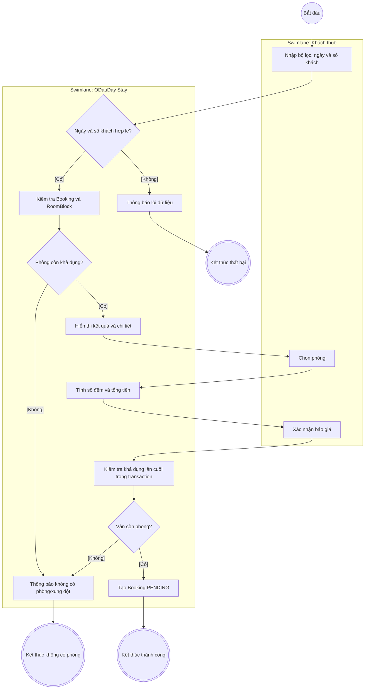
```mermaid
flowchart TB
    Start((Bắt đầu)) --> G1
    subgraph Guest[Swimlane: Khách thuê]
        G1[Nhập bộ lọc, ngày và số khách]
        G2[Chọn phòng]
        G3[Xác nhận báo giá]
    end
    subgraph System[Swimlane: ODauDay Stay]
        S1{Ngày và số khách hợp lệ?}
        S2[Kiểm tra Booking và RoomBlock]
        S3{Phòng còn khả dụng?}
        S4[Hiển thị kết quả và chi tiết]
        S5[Tính số đêm và tổng tiền]
        S6[Kiểm tra khả dụng lần cuối trong transaction]
        S7{Vẫn còn phòng?}
        S8[Tạo Booking PENDING]
        E1[Thông báo lỗi dữ liệu]
        E2[Thông báo không có phòng/xung đột]
    end
    G1 --> S1
    S1 -->|"[Không]"| E1 --> EndFail(((Kết thúc thất bại)))
    S1 -->|"[Có]"| S2 --> S3
    S3 -->|"[Không]"| E2 --> EndNoRoom(((Kết thúc không có phòng)))
    S3 -->|"[Có]"| S4 --> G2 --> S5 --> G3 --> S6 --> S7
    S7 -->|"[Không]"| E2
    S7 -->|"[Có]"| S8 --> EndOK(((Kết thúc thành công)))
```

## B.2. AD-02 — Chủ nhà xử lý đơn và kỳ lưu trú

**Liên kết:** FR-13, FR-14, FR-17; UC-08; BR-06, BR-10.

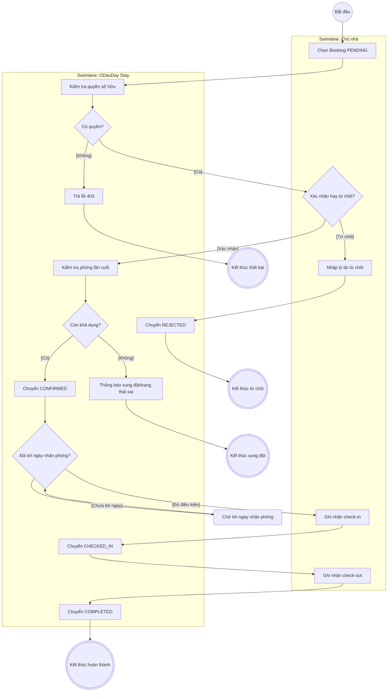
```mermaid
flowchart TB
    Start((Bắt đầu)) --> H1
    subgraph Host[Swimlane: Chủ nhà]
        H1[Chọn Booking PENDING]
        H2{Xác nhận hay từ chối?}
        H3[Nhập lý do từ chối]
        H4[Ghi nhận check-in]
        H5[Ghi nhận check-out]
    end
    subgraph System[Swimlane: ODauDay Stay]
        S1[Kiểm tra quyền sở hữu]
        S2{Có quyền?}
        S3[Kiểm tra phòng lần cuối]
        S4{Còn khả dụng?}
        S5[Chuyển CONFIRMED]
        S6[Chuyển REJECTED]
        S7{Đã tới ngày nhận phòng?}
        S8[Chuyển CHECKED_IN]
        S9[Chuyển COMPLETED]
        E1[Trả lỗi 403]
        E2[Thông báo xung đột/trạng thái sai]
    end
    H1 --> S1 --> S2
    S2 -->|"[Không]"| E1 --> EndFail(((Kết thúc thất bại)))
    S2 -->|"[Có]"| H2
    H2 -->|"[Từ chối]"| H3 --> S6 --> EndReject(((Kết thúc từ chối)))
    H2 -->|"[Xác nhận]"| S3 --> S4
    S4 -->|"[Không]"| E2 --> EndConflict(((Kết thúc xung đột)))
    S4 -->|"[Có]"| S5 --> S7
    S7 -->|"[Chưa tới ngày]"| Wait[Chờ tới ngày nhận phòng] --> S7
    S7 -->|"[Đủ điều kiện]"| H4 --> S8 --> H5 --> S9 --> EndOK(((Kết thúc hoàn thành)))
```

## B.3. AD-03 — Tạo và publish nhà/phòng

**Liên kết:** FR-09–FR-12; UC-06, UC-07; BR-06, BR-09.

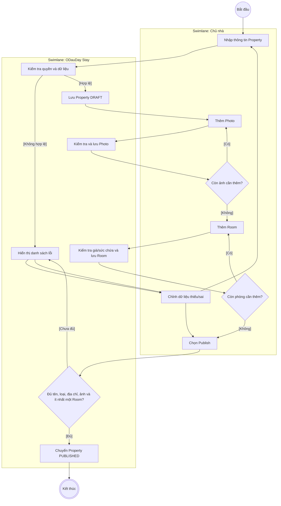
```mermaid
flowchart TB
    Start((Bắt đầu)) --> H1
    subgraph Host[Swimlane: Chủ nhà]
        H1[Nhập thông tin Property]
        H2[Thêm Photo]
        H3{Còn ảnh cần thêm?}
        H4[Thêm Room]
        H5{Còn phòng cần thêm?}
        H6[Chọn Publish]
        H7[Chỉnh dữ liệu thiếu/sai]
    end
    subgraph System[Swimlane: ODauDay Stay]
        S1[Kiểm tra quyền và dữ liệu]
        S2[Lưu Property DRAFT]
        S3[Kiểm tra và lưu Photo]
        S4[Kiểm tra giá/sức chứa và lưu Room]
        S5{Đủ tên, loại, địa chỉ, ảnh và ít nhất một Room?}
        S6[Chuyển Property PUBLISHED]
        E1[Hiển thị danh sách lỗi]
    end
    H1 --> S1
    S1 -->|"[Không hợp lệ]"| E1 --> H7 --> H1
    S1 -->|"[Hợp lệ]"| S2 --> H2 --> S3 --> H3
    H3 -->|"[Có]"| H2
    H3 -->|"[Không]"| H4 --> S4 --> H5
    H5 -->|"[Có]"| H4
    H5 -->|"[Không]"| H6 --> S5
    S5 -->|"[Chưa đủ]"| E1 --> H7 --> H6
    S5 -->|"[Đủ]"| S6 --> EndOK(((Kết thúc)))
```

## B.4. AD-04 — Kiểm tra phòng khả dụng song song

Sơ đồ này minh hoạ fork/join. Hai truy vấn kiểm tra Booking conflict và RoomBlock có thể chạy độc lập, nhưng kết quả chỉ là “available” khi cả hai đều không xung đột.

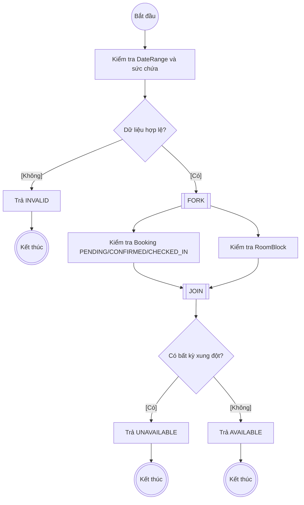
```mermaid
flowchart TB
    Start((Bắt đầu)) --> V1[Kiểm tra DateRange và sức chứa]
    V1 --> D1{Dữ liệu hợp lệ?}
    D1 -->|"[Không]"| Invalid[Trả INVALID] --> End1(((Kết thúc)))
    D1 -->|"[Có]"| Fork[[FORK]]
    Fork --> B1[Kiểm tra Booking PENDING/CONFIRMED/CHECKED_IN]
    Fork --> R1[Kiểm tra RoomBlock]
    B1 --> Join[[JOIN]]
    R1 --> Join
    Join --> D2{Có bất kỳ xung đột?}
    D2 -->|"[Có]"| Unavailable[Trả UNAVAILABLE] --> End2(((Kết thúc)))
    D2 -->|"[Không]"| Available[Trả AVAILABLE] --> End3(((Kết thúc)))
```

### Checklist review Activity Diagram

- [ ] Mỗi sơ đồ có đúng một điểm bắt đầu và ít nhất một điểm kết thúc.
- [ ] Không có action/transition treo.
- [ ] Decision có nhánh guard và merge/kết thúc hợp lý.
- [ ] Fork/join cân bằng; không dùng decision thay cho xử lý song song.
- [ ] Swimlane gán đúng trách nhiệm Actor/System.
- [ ] Mức chi tiết mô tả nghiệp vụ, không mô phỏng từng dòng code.

---

# Phụ lục C — Object Diagram và minh chứng OOP

## C.1. Object Diagram — Snapshot một kỳ lưu trú đã hoàn thành

Object Diagram biểu diễn các instance tại một thời điểm, dùng để kiểm tra multiplicity của conceptual model. Khi vẽ bằng công cụ UML, tên `objectName : ClassName` cần được gạch dưới.

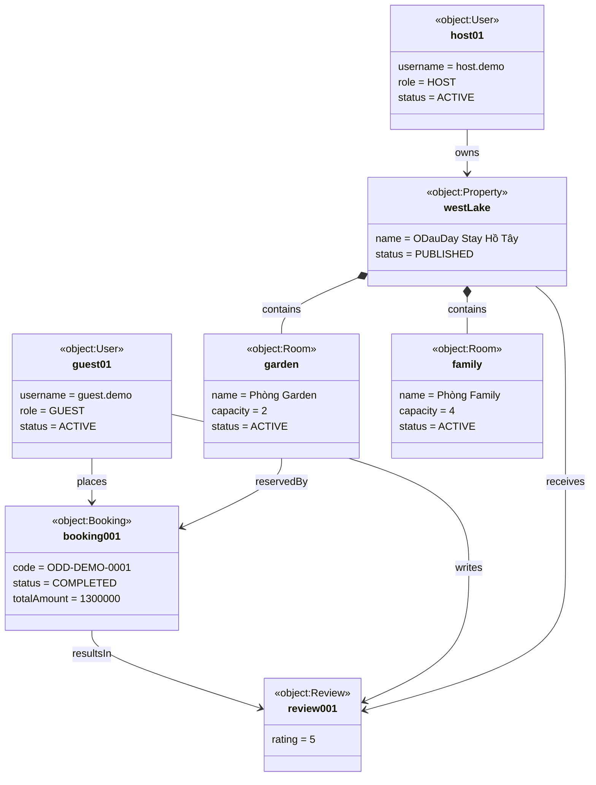
```mermaid
classDiagram
    class host01 {
        <<object:User>>
        username = host.demo
        role = HOST
        status = ACTIVE
    }
    class guest01 {
        <<object:User>>
        username = guest.demo
        role = GUEST
        status = ACTIVE
    }
    class westLake {
        <<object:Property>>
        name = ODauDay Stay Hồ Tây
        status = PUBLISHED
    }
    class garden {
        <<object:Room>>
        name = Phòng Garden
        capacity = 2
        status = ACTIVE
    }
    class family {
        <<object:Room>>
        name = Phòng Family
        capacity = 4
        status = ACTIVE
    }
    class booking001 {
        <<object:Booking>>
        code = ODD-DEMO-0001
        status = COMPLETED
        totalAmount = 1300000
    }
    class review001 {
        <<object:Review>>
        rating = 5
    }
    host01 --> westLake : owns
    westLake *-- garden : contains
    westLake *-- family : contains
    guest01 --> booking001 : places
    garden --> booking001 : reservedBy
    booking001 --> review001 : resultsIn
    guest01 --> review001 : writes
    westLake --> review001 : receives
```

**Kiểm chứng:** một Property có nhiều Room; mỗi Booking gắn đúng một Guest và một Room; Booking có tối đa một Review; Review chỉ xuất hiện khi Booking đã `COMPLETED`.

## C.2. State, behaviour và identity

| Object | State | Behaviour | Identity |
|---|---|---|---|
| `Booking` | Date range, guest count, total, `BookingStatus` | quote, confirm, reject, cancel, checkIn, complete, expire | `id` nội bộ và `code` công khai |
| `Room` | Price, capacity, `RoomStatus` | canAccommodate, quote, changePrice, activate/deactivate | `id`; duy nhất theo Property + name |
| `Property` | Details, owner, `PropertyStatus` | updateDetails, publish, deactivate, isOwnedBy | `id` |
| `User` | Profile, role, `UserStatus` | isActive, hasRole, lock/unlock | `id`, username, phone |
| `Review` | Rating, comment, createdAt | create, validateRating | `id`; `bookingId` duy nhất |

## C.3. Bốn đặc trưng OOP và message passing

| Khái niệm | Áp dụng trong ODauDay Stay | Quyết định/lý do |
|---|---|---|
| Abstraction | `BookingRepository`, `PasswordHasher`, `AvailabilityService` | Application dùng contract, không biết chi tiết MySQL/hash |
| Encapsulation | Thuộc tính entity private; đổi BookingStatus qua `confirm()`, `cancel()`, `complete()` | Ngăn code ngoài tạo trạng thái không hợp lệ |
| Information hiding | `passwordHash` không lộ ra DTO; thuật toán hash nằm sau interface | Giảm phụ thuộc và bảo vệ dữ liệu nhạy cảm |
| Inheritance | Không tạo `Guest extends User`, `Host extends User` | Vai trò có thể thay đổi; đây không phải khác biệt bản chất/vòng đời “is-a” cần subclass |
| Polymorphism | Các persistence/security adapter hiện thực cùng repository/hasher interface | Cùng message được xử lý bởi implementation khác mà Control không đổi |
| Message passing | `BookingController` gửi `confirm()` cho `Booking`; `Booking` tự bảo vệ invariant | Message là lời yêu cầu đến object; method là cách object hiện thực lời yêu cầu |

## C.4. Kiểm tra tính tốt của lớp

| Lớp | Đúng problem domain? | Có dữ liệu + hành vi? | High cohesion/một trách nhiệm? | Kết luận |
|---|---|---|---|---|
| `Booking` | Có | Có | Quản lý giao dịch và vòng đời đặt phòng | Giữ |
| `Room` | Có | Có | Giá, sức chứa, trạng thái và khả năng phục vụ | Giữ |
| `Property` | Có | Có | Thông tin và vòng đời nơi lưu trú | Giữ |
| `Review` | Có | Có | Đánh giá một kỳ lưu trú | Giữ |
| `RevenueService` | Dữ liệu dẫn xuất | Có hành vi tổng hợp | Tách khỏi Booking để tránh god class | Giữ ở Application |
| `System` chung chung | Không đủ cụ thể | Dễ gom mọi hành vi | Cohesion thấp | Không tạo |

---

# Phụ lục D — Lựa chọn view và kiến trúc triển khai

## D.1. Ánh xạ 4+1

| View | Câu hỏi | Artefact ODauDay Stay | Lý do chọn |
|---|---|---|---|
| Use Case View (+1) | Actor cần hệ thống làm gì? | UC diagram/specification, Activity Diagram | Chốt phạm vi và scenario |
| Logical View | Cấu trúc khái niệm/thiết kế là gì? | Conceptual model, CRC, Object Diagram, DCD, State Machine | Thể hiện OOA → OOD |
| Process View | Các object cộng tác theo thứ tự nào? | SSD, Sequence Diagram, Activity có concurrency | Kiểm tra message, exception và race condition |
| Implementation View | Mã nguồn được tổ chức thành phần nào? | Layering/Package, Component Diagram | Giảm coupling và truy vết sang code |
| Deployment View | Thành phần chạy ở đâu? | Deployment Diagram | Làm rõ browser, server, DB, storage |

Không phải mọi hệ thống đều cần đủ mọi view. ODauDay Stay là ứng dụng web nhiều tầng, có DB và image storage nên Component/Deployment View có giá trị; Communication Diagram không bắt buộc vì Sequence đã diễn tả đủ ba scenario chính.

## D.2. Package Diagram

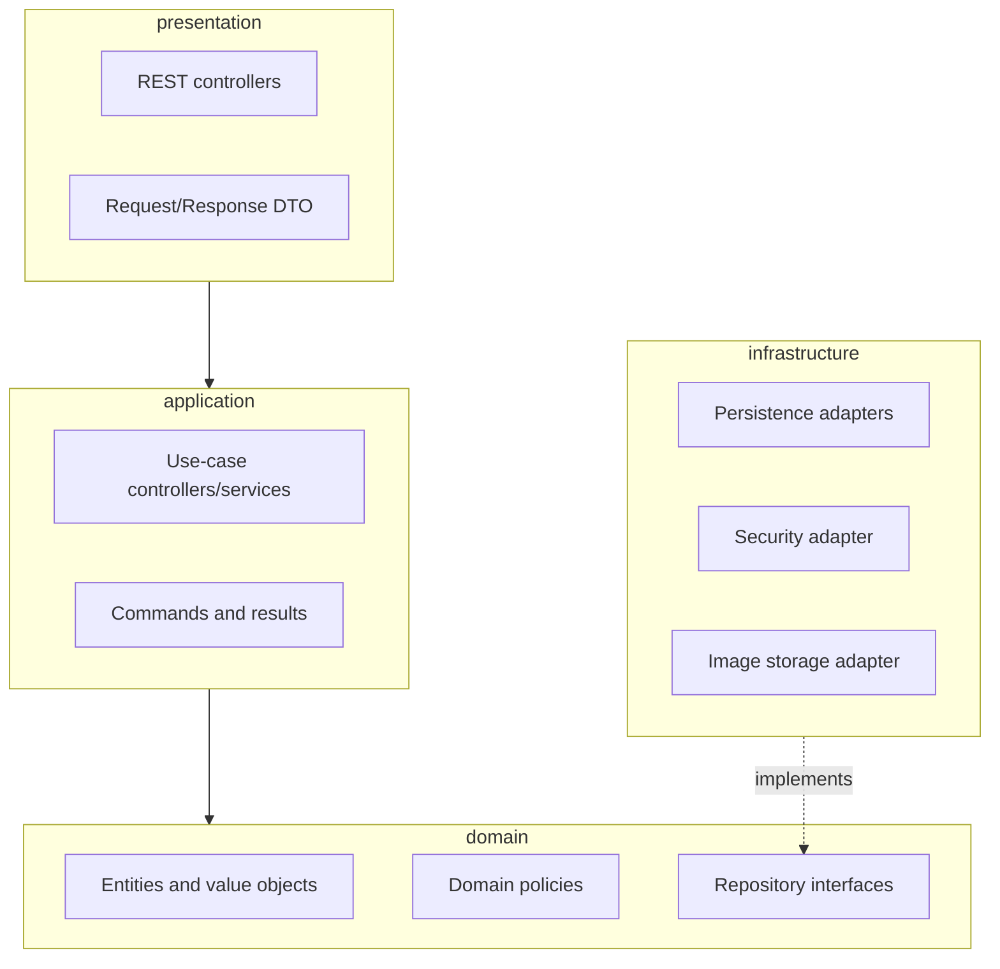
```mermaid
flowchart TB
    subgraph Presentation[presentation]
        REST[REST controllers]
        DTO[Request/Response DTO]
    end
    subgraph Application[application]
        UseCases[Use-case controllers/services]
        Commands[Commands and results]
    end
    subgraph Domain[domain]
        Model[Entities and value objects]
        Policies[Domain policies]
        Ports[Repository interfaces]
    end
    subgraph Infrastructure[infrastructure]
        Persistence[Persistence adapters]
        Security[Security adapter]
        Storage[Image storage adapter]
    end
    Presentation --> Application
    Application --> Domain
    Infrastructure -. implements .-> Ports
```

## D.3. Component Diagram

```mermaid
flowchart LR
    Browser[Web Browser] --> Frontend[Frontend Component]
    Frontend -->|HTTPS/JSON| API[REST API Component]
    API --> Application[Application Component]
    Application --> Domain[Domain Component]
    Application --> RepoPort[Repository Ports]
    MySQLAdapter[MySQL Adapter] -. implements .-> RepoPort
    MySQLAdapter --> DB[(MySQL 8)]
    Application --> ImagePort[Image Storage Port]
    ObjectAdapter[Object Storage Adapter] -. implements .-> ImagePort
    ObjectAdapter --> Storage[(Image Storage)]
```

## D.4. Deployment Diagram

```mermaid
flowchart LR
    subgraph Client[Client device]
        Browser[Browser]
    end
    subgraph WebNode[Web hosting node]
        FE[Static frontend]
    end
    subgraph AppNode[Application server]
        API[REST API]
        App[Application + Domain]
    end
    subgraph DataNode[Database node]
        DB[(MySQL 8)]
    end
    subgraph StorageNode[Object storage]
        IMG[(Property photos)]
    end
    Browser -->|HTTPS| FE
    FE -->|HTTPS/JSON| API
    API --> App
    App -->|TLS/SQL| DB
    App -->|HTTPS| IMG
```

> Các sơ đồ D.2–D.4 là kiến trúc mục tiêu. Khi có source/deployment thật, nhóm phải cập nhật tên package, component và node đúng thực tế; không dùng sơ đồ mục tiêu như bằng chứng đã triển khai.

---

# Phụ lục E — Quản lý nhóm 7–8 người và chuẩn bị vấn đáp

## E.1. Phân công ownership

| Vai trò | Ownership | Đầu ra | Reviewer chéo |
|---|---|---|---|
| TV1 — Nhóm trưởng/BA | Scope, phỏng vấn, validation, tích hợp | Biên bản, Validation Register, issue log | TV4 |
| TV2 — Requirements/UC | FR, actor, UC model/spec | FR table, UC diagram, 10 UC specs | TV3 |
| TV3 — Behaviour analyst | Activity và SSD | AD-01–AD-04, SSD | TV2, TV5 |
| TV4 — Domain analyst | Candidate, conceptual, CRC, object | Domain artefacts | TV1, TV5 |
| TV5 — OO designer | BCE, sequence, state, DCD, GRASP/SOLID | Design artefacts | TV4, TV6 |
| TV6 — Data/backend | ERD, SQL, transaction, mapping code | Schema/seed/migration, DB evidence | TV5, TV8 |
| TV7 — Frontend/UX | UI flow và ảnh minh chứng | UI theo UC, responsive evidence | TV2, TV8 |
| TV8 — QA/Release | Test, traceability, format, mock viva | Test report, final PDF | TV1, TV6 |

Nếu có 7 người, gộp Data/backend với backend implementation; nên giữ QA/Release độc lập với Requirements để bảo đảm review chéo.

## E.2. Contribution Matrix

Điền tên và bằng chứng thật trước khi nộp.

| Thành viên | Họ tên/MSSV | Artefact chính | Artefact đã review | UC bảo vệ xuyên suốt | Bằng chứng commit/biên bản |
|---|---|---|---|---|---|
| TV1 | **[Điền]** | **[Điền]** | **[Điền]** | **[Điền]** | **[Điền]** |
| TV2 | **[Điền]** | **[Điền]** | **[Điền]** | **[Điền]** | **[Điền]** |
| TV3 | **[Điền]** | **[Điền]** | **[Điền]** | **[Điền]** | **[Điền]** |
| TV4 | **[Điền]** | **[Điền]** | **[Điền]** | **[Điền]** | **[Điền]** |
| TV5 | **[Điền]** | **[Điền]** | **[Điền]** | **[Điền]** | **[Điền]** |
| TV6 | **[Điền]** | **[Điền]** | **[Điền]** | **[Điền]** | **[Điền]** |
| TV7 | **[Điền]** | **[Điền]** | **[Điền]** | **[Điền]** | **[Điền]** |
| TV8 | **[Điền nếu có]** | **[Điền]** | **[Điền]** | **[Điền]** | **[Điền]** |

## E.3. Checklist vấn đáp cá nhân

Mỗi thành viên phải giải thích được:

1. OOA khác OOD; UML là ngôn ngữ mô hình hóa, không phải phương pháp luận.
2. FR khác NFR; yêu cầu được thu thập, ghi nhận và validation như thế nào.
3. Vì sao một chức năng là Use Case thay vì thao tác giao diện nhỏ.
4. Hướng và ý nghĩa của generalization, `include`, `extend` trong sơ đồ hiện tại.
5. Activity Diagram khác flowchart ở concurrency và swimlane.
6. Conceptual model khác BCE/DCD và ERD.
7. Vì sao Booking là association class; multiplicity nào bảo vệ quy tắc nghiệp vụ.
8. Actor → Boundary → Control → Entity; vì sao Entity không gọi ngược UI.
9. Message trong Sequence ánh xạ tới operation nào trong DCD.
10. State transition nào bị cấm và object nào bảo vệ invariant.
11. GRASP Information Expert/Creator/Controller và SOLID được áp dụng ở đâu.
12. Vì sao cần transaction để chống hai khách đặt trùng phòng.

---

# Phụ lục F — Quality Gate trước khi nộp

## F.1. Requirements Gate

- [ ] Phương pháp khảo sát (giả định + tài liệu nền tảng) được nêu rõ ở Phụ lục A.
- [ ] Mọi FR có actor, nguồn, UC, priority và acceptance criteria.
- [ ] NFR ghi rõ đâu là mục tiêu thiết kế (`ASSUM-NFR`), không tuyên bố là số đo thực tế.
- [ ] Validation Register đã đóng các điểm mâu thuẫn quan trọng.

## F.2. UML Gate

- [ ] Vẽ bản cuối bằng công cụ UML; actor ngoài và UC trong system boundary.
- [ ] 100% UC có tên, actor, goal, overview, cross-reference, precondition, main/alternative flow và postcondition.
- [ ] Activity có start/final, guard, decision/merge, fork/join cân bằng và swimlane đúng.
- [ ] Conceptual model không lẫn Controller/Repository/DB/API.
- [ ] Association có role/multiplicity; composition/generalization có lý do.
- [ ] BCE tuân thủ Actor → Boundary → Control → Entity.
- [ ] Sequence message khớp DCD operation.
- [ ] State Machine, DCD enum và SQL `CHECK` khớp hoàn toàn.

## F.3. Evidence Gate

- [ ] Prototype mở được bằng trình duyệt; 20 màn hình hiển thị đúng.
- [ ] Ảnh UI trong `docs/evidence/ui/` khớp bảng 4.2 và 4.3.
- [ ] Mỗi test case ở bảng 4.3 có kết quả mức UI hoặc lý do không thực thi (TC-15).
- [ ] Dữ liệu prototype khớp `seed.sql` (mục 3.4.4).
- [ ] Mục 4.0 nêu rõ giới hạn: không backend/CSDL/xác thực thật.

## F.4. Defense Gate

- [ ] Mỗi artefact có một tác giả và ít nhất một reviewer.
- [ ] Mỗi thành viên bảo vệ được một vertical slice từ FR → UC → Activity/SSD → Sequence/DCD → DB → Test.
- [ ] Đã tổ chức ít nhất hai vòng mock viva.

---

# Tài liệu tham khảo

1. Nguyễn Hiếu Cường, **Bài 1: Giới thiệu**, học phần Phân tích thiết kế hướng đối tượng, ĐH Giao thông Vận tải, 2025 (`Bai-01 M.pdf`).
2. Nguyễn Hiếu Cường, **Bài 2: Cơ sở về lập trình hướng đối tượng**, ĐH Giao thông Vận tải, 2025 (`Bai-02 M.pdf`).
3. Nguyễn Hiếu Cường, **Bài 3: Xác định yêu cầu**, ĐH Giao thông Vận tải, 2025 (`Bai-03 M.pdf`).
4. Nguyễn Hiếu Cường, **Bài 4: Mô hình ca sử dụng**, ĐH Giao thông Vận tải, 2025 (`Bai-04 M.pdf`).
5. Nguyễn Hiếu Cường, **Bài 5: Sơ đồ hành động**, ĐH Giao thông Vận tải, 2026 (`Bai-05 M.pdf`).
6. Nguyễn Hiếu Cường, **Bài 6: Phân tích đối tượng**, ĐH Giao thông Vận tải, 2026 (`Bai-06 M.pdf`).
7. **Hướng dẫn thực hiện BTL (lớp LT)** — học phần Phân tích thiết kế hướng đối tượng.
8. Object Management Group, **Unified Modeling Language (UML)**.
9. Craig Larman, **Applying UML and Patterns** — GRASP, phân tích và thiết kế hướng đối tượng.
10. Robert C. Martin, **Agile Software Development: Principles, Patterns, and Practices** — SOLID.
11. Tài liệu MySQL 8 — ràng buộc, transaction và chỉ mục.

## Checklist trước khi nộp

- [ ] Điền lớp, nhóm, họ tên/MSSV, giảng viên và thời gian.
- [ ] Render toàn bộ Mermaid thành hình rõ nét khi xuất DOCX/PDF.
- [ ] Đánh số hình/bảng và cập nhật mục lục theo mẫu của khoa.
- [ ] Kiểm tra lại phạm vi với giảng viên; không tự thêm thanh toán nếu chưa được duyệt.
- [ ] Nếu nộp Chương 4: chèn ảnh UI thật, folder tree thật và kết quả test đã chạy.
- [ ] Nộp kèm file nguồn sơ đồ để có thể chỉnh sửa.
